# DHCP: настройка серверов, relay и анализ пакетов

## Техническое задание

1.  **Построить базовую топологию**:
    
    *   3 клиента (Windows, Ubuntu, VPCS) → Switch → MikroTik.
        
    *   Подсеть: 192.168.10.0/24.
        
2.  **Настройка DHCP на MikroTik**:
    
    *   Интерфейс ether1: 192.168.10.1/24.
        
    *   Пул адресов: 192.168.10.10–192.168.10.100.
        
    *   DNS-сервер: 8.8.8.8.
        
    *   Время аренды: 1 день.
        
3.  **Анализ DORA**:
    
    *   Подключить один ПК, запустить Wireshark.
        
    *   Отфильтровать трафик по dhcp.
        
    *   Захватить и проанализировать пакеты: Discover, Offer, Request, Ack.
        
4.  **Анализ дополнительных сообщений DHCP**:
    
    *   **NAK**: клиент запрашивает IP вне пула.
        
    *   **DECLINE**: клиент сообщает, что IP уже используется.
        
    *   **RELEASE**: клиент освобождает адрес.
        
    *   **INFORM**: клиент запрашивает параметры без аренды IP.
        
5.  **Статическая привязка IP**:
    
    *   Задать фиксированный IP по MAC-адресу для одного клиента.
        
    *   Проверить выдачу того же адреса при переподключении.
        
6.  **Настройка DHCP на Ubuntu**:
    
    *   Установить isc-dhcp-server, отключить DHCP на MikroTik.
        
    *   Настроить пул: 192.168.10.10–192.168.10.100.
        
7.  **Настройка DHCP Relay**:
    
    *   Первая подсеть: Ubuntu DHCP-сервер + 3 ПК → MikroTik.
        
    *   Вторая подсеть: группа ПК → MikroTik.
        
    *   Настроить маршрутизацию между подсетями.
        
    *   Настроить DHCP Relay на MikroTik для пересылки запросов из второй подсети на Ubuntu-сервер.
        
    *   Проверить выдачу IP и параметров во второй подсети.

---

> Полный список команд для настройки, MikroTik и ПК, с краткими комментариями к каждой команде в файле .

* * *

### 1. Построить топологию

Для начала соберём в GNS3 простую сеть. В неё входят три клиента — Windows 10, Ubuntu и лёгкий эмулятор VPCS. Все они подключаются к коммутатору Switch-1, а коммутатор связан с маршрутизатором MikroTik. На данном этапе маршрутизатор будет выполнять исключительно роль DHCP-сервера, раздавая IP-адреса клиентам внутри сети.

Подсеть *192.168.10.0/24* рассчитана на 254 рабочих хоста. Первый адрес в сети (192.168.10.0) зарезервирован как сетевой идентификатор, а последний (192.168.10.255) используется для широковещательных рассылок внутри подсети. Соответственно, рабочие адреса находятся в диапазоне от 192.168.10.1 до 192.168.10.254.

* * *

### 2. Настройка DHCP на MikroTik

Переходим к настройке MikroTik. При первом запуске MikroTik через консоль, устройство запрашивает логин и пароль для входа. По умолчанию логин - **admin**, а пароль отсутствует (просто нажимаем Enter). Однако при первой настройке система обязательно требует задать новый пароль, так как пустой пароль оставить нельзя - это связано с тем, что новый пароль не может совпадать с текущим (то есть пустым) для безопасности доступа. Поэтому при вводе пустого пароля появится ошибка, и потребуется ввести пароль для последующего входа.

* * *

После входа первым шагом назначаем IP-адрес интерфейсу, через который будут подключены клиенты — в нашем случае ether1. IP-адрес задаётся в рамках подсети 192.168.10.0/24, где «/24» указывает на маску подсети 255.255.255.0. Маска подсети определяет, какие адреса считаются частью локальной сети и позволяет устройствам корректно обмениваться данными между собой. Без назначения IP и маски клиенты не смогут взаимодействовать с сервером DHCP.

Следующим шагом создаём пул IP-адресов — диапазон адресов, из которого DHCP-сервер будет автоматически выдавать IP клиентам. В нашем случае пул охватывает адреса от 192.168.10.10 до 192.168.10.100. Кроме того, при настройке DHCP указывается DNS-сервер, например 8.8.8.8, чтобы клиенты могли корректно разрешать имена в сети и в Интернете. Пул и указание DNS позволяют централизованно управлять распределением адресов, предотвращать конфликты и обеспечивать корректную работу всех устройств. Время аренды (lease) устанавливается на один день, что позволяет автоматически освобождать адреса от устройств, которые больше не подключены, и повторно использовать их для новых клиентов.

Использование пула также упрощает организацию сети: адреса вне пула можно резервировать для статических устройств, таких как серверы или принтеры, чтобы они не попадали под автоматическую выдачу DHCP. Таким образом, пул, маска подсети и DNS-сервер являются ключевыми элементами настройки DHCP, обеспечивая корректное, уникальное и управляемое распределение IP-адресов для всех клиентов.

* * *

### 3. Анализ DORA

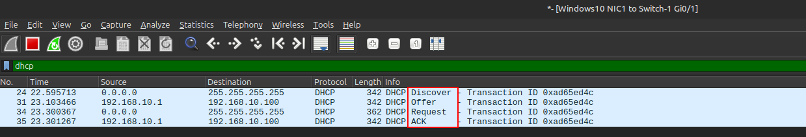

* * *

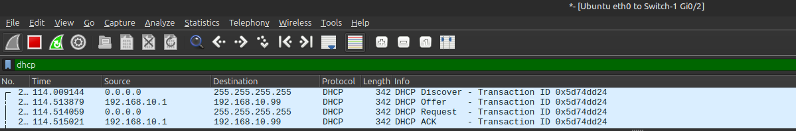

* * *

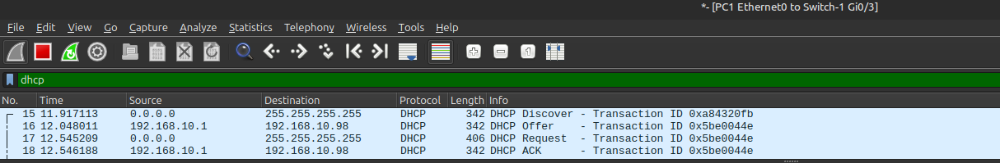

* * *

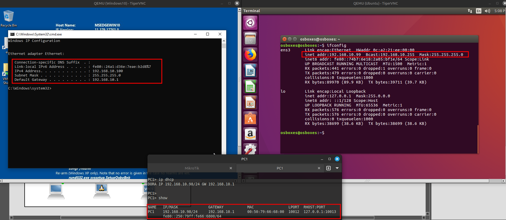

После того как DHCP-сервер был поднят и включён, все устройства в сети автоматически получили свои настройки. Каждый клиент получил IP-адрес, который уникален в пределах пула, заданного на сервере, маску подсети, чтобы понимать, какие адреса относятся к локальной сети, шлюз, который в будущих задачах позволит устройствам выходить в другие сети, и DNS-сервер, чтобы корректно разрешать доменные имена. Кроме того, передаются и другие параметры, необходимые для нормальной работы сети, например время аренды адреса.

Все эти данные передаются по протоколу DHCP, и процесс получения IP-адреса клиентом можно проследить через последовательность сообщений DORA: Discover, Offer, Request и Acknowledgment. Сначала клиент рассылает запрос на получение адреса (Discover), сервер отвечает предложением свободного IP (Offer), клиент подтверждает выбор адреса (Request), а сервер завершает процесс, подтверждая выдачу IP (Acknowledgment). Благодаря этому механизму устройства получают все необходимые параметры автоматически и готовы к работе в сети.

Теперь переходим к самому процессу DORA и разберём каждый его этап подробно на примере одного устройства, чтобы наглядно показать, что именно происходит между клиентом и сервером на каждом шаге.

* * *

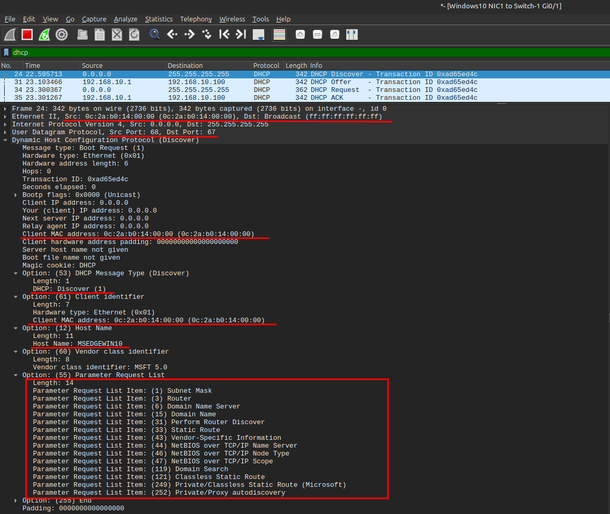

Когда устройство подключается к сети и ещё не имеет IP-адреса, оно отправляет **DHCP Discover** — первый шаг процесса DORA. Проще говоря, клиент сообщает сети, что он новый и хочет получить настройки для работы. Разберём, что при этом реально происходит на каждом уровне.

**Канальный уровень (Ethernet II):** На этом уровне пакет отправляется широковещательно с адресом назначения `ff:ff:ff:ff:ff:ff`, чтобы все устройства в локальной сети получили сообщение. Это необходимо, так как клиент ещё не знает, где находится DHCP-сервер. Источник пакета — MAC-адрес клиента, уникальный идентификатор его сетевой карты. Благодаря этому любой DHCP-сервер в сети сможет определить, кто делает запрос и ответить на него.

**Сетевой уровень (IP):** Клиент ещё не имеет IP-адреса, поэтому в качестве источника используется `0.0.0.0`. Назначение пакета — `255.255.255.255`, чтобы широковещательно достичь всех устройств локальной сети. Эта двойная широковещательная рассылка (на канальном и сетевом уровнях) гарантирует, что Discover дойдет до всех DHCP-серверов в подсети, даже если их несколько.

**Транспортный уровень (UDP):** Клиент отправляет пакет через порт 68, а DHCP-серверы принимают его на порту 67. UDP используется для передачи без установки соединения, что упрощает и ускоряет процесс. Каждый сервер в сети получает возможность обработать запрос и предложить клиенту свободный IP-адрес.

**Прикладной уровень (DHCP):** Основная информация запроса находится здесь. Тип сообщения — Discover, что обозначает поиск DHCP-сервера. Transaction ID уникален для этой попытки, чтобы клиент смог сопоставить полученные ответы с отправленным запросом. IP-поля ещё пусты, так как клиент не имеет адреса. Опции DHCP включают: Message Type = Discover, Client Identifier (MAC клиента), Host Name, Vendor class identifier (например, MSFT 5.0) и Parameter Request List с перечнем необходимых настроек — маска подсети, шлюз, DNS и другие параметры. Discover информирует серверы о присутствии нового клиента и его потребностях, позволяя начать процесс предоставления адреса и сетевых настроек.    

Итак, **Discover** — это просто запрос клиента на получение IP и других настроек. Сервер пока ещё ничего не раздаёт, он только получает информацию о том, кто подключился и что именно нужно этому устройству.

* * *

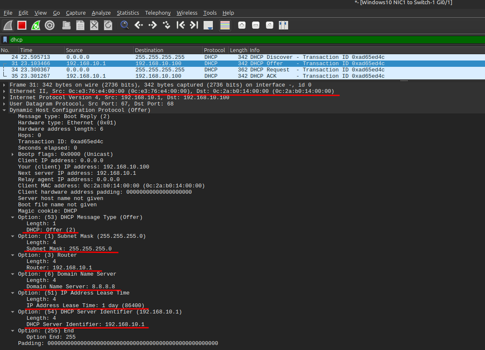

Когда DHCP-сервер получает Discover от клиента, он отвечает **DHCP Offer** — вторым шагом процесса DORA. Сервер предлагает клиенту конкретный IP-адрес и необходимые параметры сети. Пакет отправляется unicast, чтобы выбранный клиент получил предложение напрямую, а остальным серверам было понятно, что адрес занят.

**Канальный уровень (Ethernet II):** На этом уровне пакет адресован напрямую MAC-адресу клиента (`0e:2a:b0:14:00:00`). Источник — MAC-адрес сервера (`0c:63:76:e4:00:00`). В отличие от Discover, это не широковещание, а unicast, поэтому сервер может напрямую сообщить клиенту, какой IP он предлагает.

**Сетевой уровень (IP):** Источник пакета — IP сервера DHCP (192.168.10.1), а назначение — IP, который сервер предлагает клиенту (192.168.10.100). На этом уровне сервер «предлагает» клиенту адрес, который тот сможет использовать, как только подтвердит выбор.

**Транспортный уровень (UDP):** Сервер использует порт 67 как источник, а клиент принимает на порту 68. UDP позволяет передать пакет быстро, без установления соединения, и гарантирует, что клиент получит предложение сервера.

**Прикладной уровень (DHCP):** Тип сообщения — Offer, Transaction ID совпадает с Discover, чтобы клиент смог сопоставить ответ с отправленным запросом. Основное поле — Your (Client) IP address — содержит предлагаемый адрес (192.168.10.100). Опции DHCP включают Server Identifier (192.168.10.1), IP Address Lease Time, Subnet Mask, Router, DNS и Domain Name. Эти параметры позволяют клиенту узнать, какие настройки сети он получит при принятии адреса.

**Итог:** DHCP Offer — это конкретное предложение от сервера клиенту с IP и сетевыми параметрами. На этом этапе клиент может принять предложение и перейти к следующему шагу — DHCP Request, чтобы окончательно закрепить адрес.

* * *

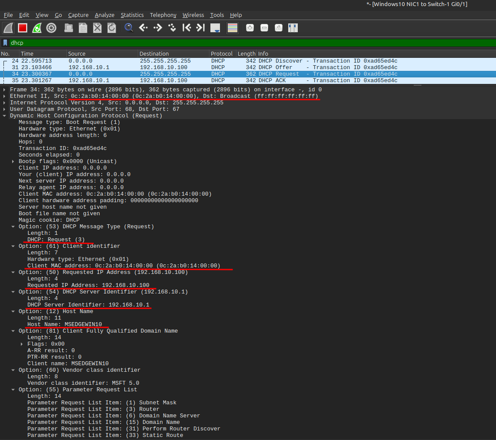

После того как клиент получил предложение от сервера (**Offer**), он отправляет **DHCP Request** — третий шаг процесса DORA. В этом пакете клиент подтверждает свой выбор IP и уведомляет сеть о том, что собирается использовать предложенный адрес. При этом пакет отправляется широковещательно, чтобы выбранный сервер понял, что его оффер принят, а остальные DHCP-серверы могли освободить свои предложения.

**Канальный уровень (Ethernet II):** Пакет адресован всем устройствам сети (`ff:ff:ff:ff:ff:ff`), что позволяет выбранному серверу увидеть подтверждение, а остальным серверам — понять, что их предложения отклонены и адреса могут вернуться в пул. Источник — MAC-адрес клиента (`0e:2a:b0:14:00:00`), уникальный идентификатор его сетевого интерфейса.

**Сетевой уровень (IP):** Источник пакета — `0.0.0.0`, так как клиент ещё не получил окончательно назначенный IP. Назначение — `255.255.255.255` для доставки пакета всем устройствам локальной сети. Эта широковещательная рассылка гарантирует, что пакет достигнет выбранного сервера и всех остальных серверов, если они есть в сети.

**Транспортный уровень (UDP):** Клиент использует порт 68 как источник, а сервер слушает порт 67 как пункт назначения. UDP позволяет передать пакет быстро и без установки соединения, обеспечивая доставку сообщения всем DHCP-серверам в сети.

**Прикладной уровень (DHCP):** Тип сообщения — Request, Transaction ID совпадает с Discover и Offer, связывая всю транзакцию DORA. IP-поля ещё пусты, так как аренда адреса не подтверждена окончательно. Опции DHCP включают Message Type = Request, Server Identifier = 192.168.10.1, Requested IP = 192.168.10.100, Client Identifier = MAC клиента, Host Name = MSEDGEWIN10, Vendor class = MSFT 5.0, а также Parameter Request List с маской подсети, шлюзом, DNS и другими параметрами для финального ACK.

**Итог:** DHCP Request уведомляет сеть о принятии предложения сервера. Клиент готов получить окончательное подтверждение, после чего IP и настройки сети станут действительными, что произойдет на следующем шаге — DHCP Acknowledgment.

* * *

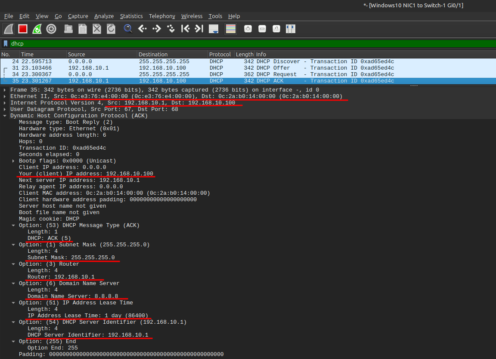

После того как клиент отправил **Request**, сервер подтверждает окончательный выбор IP-адреса и сетевых параметров с помощью **DHCP ACK** — четвертого и последнего шага процесса DORA. Этот пакет официально закрепляет за клиентом IP и все настройки сети, после чего устройство может начать полноценную работу в локальной сети.

**Канальный уровень (Ethernet II):** На этом уровне пакет отправляется напрямую клиенту (unicast) на MAC-адрес `0e:2a:b0:14:00:00`. Источник — MAC-адрес DHCP-сервера (`0c:63:76:e4:00:00`). Unicast используется, чтобы точно доставить подтверждение выбранного адреса конкретному устройству и исключить ненужное широковещание.

**Сетевой уровень (IP):** Источник пакета — IP сервера DHCP (192.168.10.1), а назначение — IP, который теперь официально закреплен за клиентом (192.168.10.100). На этом уровне пакет уже адресован непосредственно назначенному IP, что отличается от предыдущих шагов, где IP клиента ещё не был известен.

**Транспортный уровень (UDP):** Сервер использует порт 67 как источник, а клиент принимает на порту 68. UDP обеспечивает быструю доставку без установки соединения и гарантирует, что клиент получит все параметры сети для корректной работы.

**Прикладной уровень (DHCP):** Тип сообщения — ACK, Transaction ID совпадает с предыдущими пакетами Discover, Offer и Request, связывая всю транзакцию DORA. Поле Your (Client) IP address содержит назначенный IP (192.168.10.100). Опции DHCP включают окончательные параметры: Subnet Mask (255.255.255.0), Router (192.168.10.1), DNS-сервер (8.8.8.8), IP Address Lease Time (1 день), Server Identifier (192.168.10.1) и окончание списка (Option 255). Клиент применяет эти настройки к своему сетевому интерфейсу, после чего может полноценно работать в сети, включая доступ к внешним ресурсам через указанный шлюз и использование DNS для разрешения доменных имен.

**Итог:** DHCP ACK завершает процесс DORA, официально назначая клиенту IP-адрес и сетевые параметры. После получения этого пакета устройство готово к работе в локальной сети с корректной конфигурацией и возможностью выхода в другие сети.

* * *

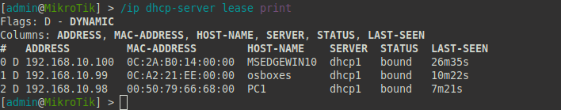

Команда `ip dhcp-server lease print` на MikroTik показывает, какие IP-адреса сервер DHCP в данный момент выдал устройствам в сети. В нашем случае сервер dhcp1 раздал адреса трём устройствам: Windows, Ubuntu и VPCS.

В таблице видно, что каждому устройству присвоен уникальный IP из пула, указан его MAC-адрес и имя хоста. Статус bound означает, что аренда активна — то есть устройство сейчас использует этот IP и может полноценно работать в сети. Например, Windows получил 192.168.10.100, Ubuntu — 192.168.10.99, а VPCS — 192.168.10.98.

DHCP-сервер успешно выполнил свою работу: все три устройства автоматически получили IP, маску подсети, шлюз и другие необходимые сетевые параметры. Они теперь могут обмениваться данными в локальной сети и в будущем использовать шлюз для выхода в другие подсети или интернет.

* * *

### 4. Анализ дополнительных сообщений DHCP

#### Release

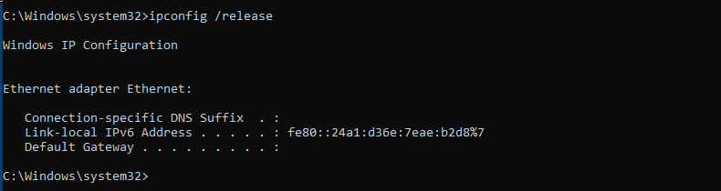

* * *

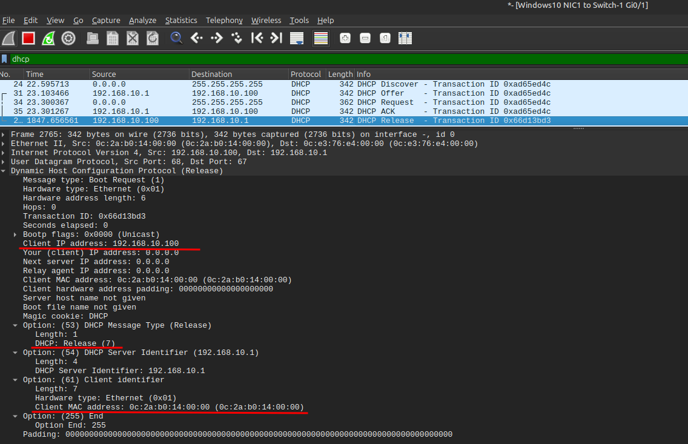

* * *

Когда на клиентском компьютере Windows выполняется команда `ipconfig /release`, устройство сообщает DHCP-серверу, что больше не нуждается в арендованном IP-адресе. В нашем примере клиент отправляет **DHCP Release** серверу 192.168.10.1, освобождая адрес 192.168.10.100. Это значит, что сервер может вернуть этот IP обратно в пул свободных адресов, чтобы другие устройства могли его использовать.

На клиенте после выполнения команды IPv4-адрес исчезает, шлюз и DNS-сервер больше не назначены. Клиент не может обмениваться данными за пределами локальной сети, пока снова не получит адрес через DHCP. IPv6-адреса остаются, так как команда касается только IPv4.

Сетевой пакет Release отправляется **unicast** прямо на сервер (не широковещательно). Источник — старый IP клиента (192.168.10.100), а назначение — IP сервера (192.168.10.1). В пакете указаны тип сообщения (Release), идентификатор клиента (MAC) и идентификатор сервера, чтобы DHCP точно понял, какую аренду нужно завершить.

На сервере MikroTik после получения этого пакета запись об аренде для клиента немедленно обновляется: адрес возвращается в пул доступных, а статус аренды меняется с `bound` на `released` (или запись удаляется из списка активных арен).

Проще говоря, **DHCP Release** — это способ клиента корректно «вернуть» IP серверу, завершив использование адреса. Так адрес больше не занят, сервер может выдать его другому устройству.

* * *

#### NAK

После того как клиент Windows освободил IP-адрес 192.168.10.100 с помощью команды **ipconfig /release**, сервер вернул этот адрес в пул свободных. Позже пул DHCP был изменён командой `/ip pool set dhcp_pool ranges=192.168.10.10-192.168.10.99` и теперь включает только адреса **192.168.10.10–192.168.10.99**. Когда Windows попытался снова получить IP 192.168.10.100, сервер ответил отрицательным подтверждением — **DHCP NAK**. Это сообщение говорит клиенту, что запрошенный адрес недействителен и использовать его нельзя.

DHCP NAK рассылается широковещательно, чтобы гарантировать, что клиент получит уведомление. В сообщении сервер указывает, какой IP не может быть использован, и свой идентификатор, чтобы клиент точно понимал, что это ответ нужного сервера. Получив NAK, клиент сразу перестаёт использовать старый IP и запускает процесс получения нового адреса с нуля: сначала отправляет Discover, потом получает Offer, подтверждает Request и получает ACK с новым IP. В нашем случае Windows получил адрес **192.168.10.97**, который входит в текущий пул.

Причины, по которым сервер может отправить NAK, разнообразны. Самая частая — клиент запросил адрес, который больше не входит в пул или уже занят другим устройством. Также NAK может возникнуть, если клиент пытается продлить аренду старого IP, который сервер больше не признаёт, или если указал неверный сервер для продления аренды. В целом, DHCP NAK — это механизм защиты, который предотвращает конфликты IP-адресов и гарантирует, что устройства используют только допустимые адреса из текущего пула.

* * *

#### INFORM

После того как устройство уже получило IP-адрес и другие настройки через DHCP, иногда возникает необходимость запросить у DHCP-сервера только дополнительные параметры сети, не меняя при этом IP. Для этого используется сообщение DHCP INFORM. Клиент отправляет его на сервер, чтобы получить, например, актуальные DNS-серверы, доменное имя или другие опции, которые могут изменяться в сети, не затрагивая его текущий IP.

Сообщение INFORM отправляется с IP-адреса, который уже назначен устройству, и сервер отвечает обычным DHCP ACK, содержащим запрошенные параметры. Это полезно, если в сети обновились настройки DNS, шлюзы или другие сервисные параметры, и клиенту нужно их получить без запроса нового IP.

В отличие от Discover, Request или Release, INFORM не участвует в выдаче IP-адреса, а служит только для получения информации. Команды на Windows `ipconfig /renew`, на Linux `dhclient -1 -v -s 192.168.10.1>`

* * *

#### Decline

Сообщение **DHCP DECLINE** используется клиентом, когда он обнаруживает, что IP-адрес, предложенный DHCP-сервером, уже занят другим устройством. Например, клиент получил Offer с адресом 192.168.10.50, но проверка ARP показала, что этот адрес уже используется другим хостом. В этом случае клиент не может безопасно использовать IP и отправляет серверу сообщение DECLINE, чтобы уведомить о конфликте.

После получения DECLINE сервер помечает этот адрес как недоступный и больше не выдаёт его другим клиентам, пока администратор или сервер не решат вопрос конфликта. Таким образом, DHCP DECLINE предотвращает конфликты IP-адресов в сети и обеспечивает корректную работу всех устройств.

Важно отметить, что при DECLINE клиент **не теряет текущий рабочий IP**, если он уже использует какой-то другой адрес. Это чисто защитный механизм для обработки предложений от сервера, которые потенциально могут вызвать конфликт.

Пример использования: Windows и Linux автоматически отправляют DECLINE, если при проверке Offer обнаруживают совпадение IP в сети через ARP.

* * *

### 5. Статическая привязка IP

* * *

* * *

В DHCP существует возможность **закрепить конкретный IP-адрес за определённым устройством**, используя его MAC-адрес. Этот механизм называется **Static Lease** (статическая аренда) и позволяет гарантировать, что выбранный клиент всегда будет получать один и тот же адрес, независимо от динамического пула.

На практике это делается так: администратор на MikroTik вручную создаёт запись, где указывает IP-адрес, MAC-адрес клиента, имя сервера DHCP и комментарий для удобства. В нашем случае виртуальной машине Ubuntu с MAC `0c:a2:21:ee:00:00` был назначен статический IP `192.168.10.105`. Команда для настройки выглядит следующим образом: `/ip dhcp-server lease add address=192.168.10.105 mac-address=0c:a2:21:ee:00:00 comment="Ubuntu fixed IP" server=dhcp1`

После применения этой настройки DHCP-сервер больше никогда не выдаст этот IP другому устройству. Если клиент с указанным MAC пытается использовать другой адрес из пула, сервер отправит NAK, и клиент будет вынужден запросить новую конфигурацию. В нашем примере Ubuntu сначала получила отказ, а затем, через стандартный процесс DORA, корректно получила закреплённый за ней адрес 192.168.10.105.

* * *

### 6. Настройка DHCP на Ubuntu

* * *

Мы переносим DHCP-сервер с MikroTik на Ubuntu. Раньше адреса раздавал MikroTik с IP 192.168.10.1, теперь это будет выделенный сервер Ubuntu. Сначала отключаем DHCP на MikroTik, чтобы клиенты больше не получали от него IP.

* * *

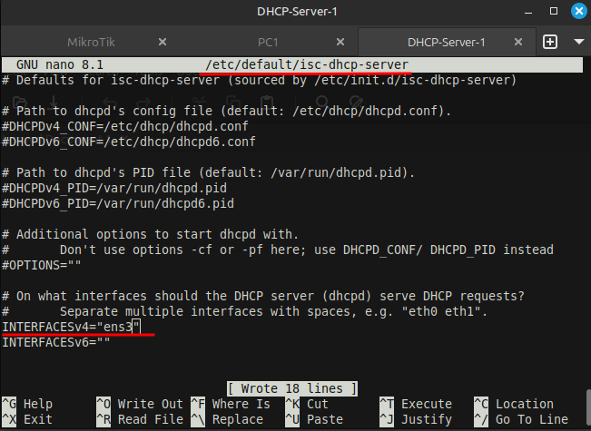

Сначала нужно убедиться, что сам пакет установлен. Если нет, ставим его командой: `sudo apt install isc-dhcp-server`. После установки нужно сказать серверу, на каком сетевом интерфейсе слушать запросы клиентов. Это делается в файле `/etc/default/isc-dhcp-server`. Открываем его и правим строку: `INTERFACESv4="ens3"`. **ens3** — это имя моего сетевого интерфейса, у вас оно может быть другим.

* * *

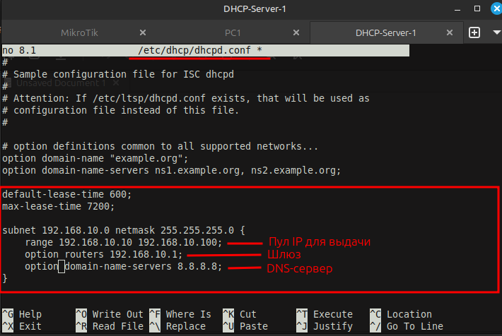

Дальше идём в основной конфигурационный файл `/etc/dhcp/dhcpd.conf`. Там задаём параметры сети: пул выдаваемых адресов, шлюз, DNS и время аренды.
То есть сервер теперь знает, кому и какие адреса раздавать, через какой шлюз, какой DNS давать и на сколько времени выдавать аренду.

* * *

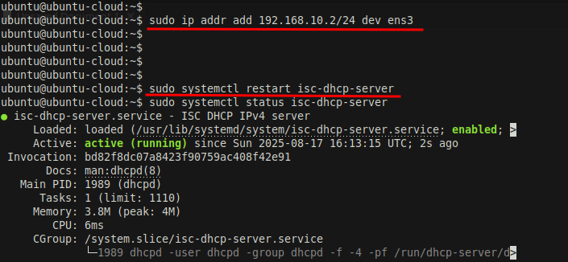

Серверу назначаем статический IP **192.168.10.2/24**. Теперь Ubuntu Server готова выдавать IP-адреса клиентам. Запускаем службу командой `sudo systemctl start isc-dhcp-server` Для проверки статуса `sudo systemctl status isc-dhcp-server`

* * *

* * *

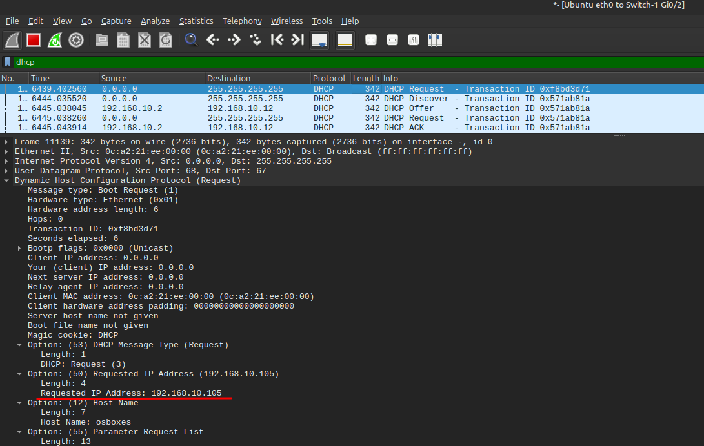

Когда клиенты начинают общаться с новым сервером, происходит вот что: Windows пытался взять старый адрес 192.168.10.97 — сервер его подтвердил, потому что адрес был свободен в новом пуле. А вот Ubuntu-клиент, который раньше имел статический адрес 192.168.10.105 на MikroTik, больше не может его получить, так как адрес не входит в новый диапазон. Сервер игнорирует этот запрос, и клиент заново отправляет Discover, получает Offer, делает Request и в итоге получает новый адрес из пула — 192.168.10.12.

* * *

В итоге, проверка таблицы аренд показывает: Windows сохранил свой старый адрес, Ubuntu получила новый, а vpc тоже получил свой IP из нового диапазона.

* * *

### 7. Настройка DHCP Relay

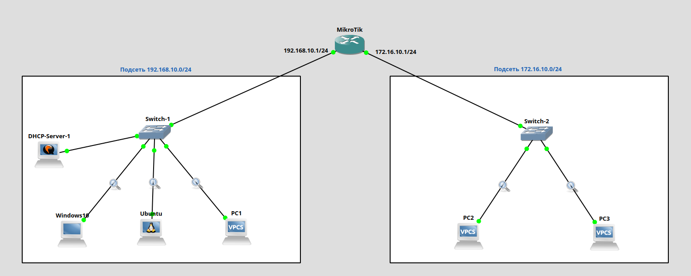

В нашей сети теперь две подсети: старая 192.168.10.0/24 и новая 172.16.10.0/24. DHCP-сервер (Ubuntu Server, 192.168.10.2) пока знает только пул для первой подсети. То есть, если клиенты из новой подсети (PC2, PC3) отправляют DHCP Discover, сервер их просто не видит — широковещательные пакеты не переходит через маршрутизатор.

Чтобы это исправить, мы используем MikroTik в роли DHCP Relay и настраиваем маршрутизацию.

* * *

#### 1. Настройка маршрутизации на MikroTik

На интерфейс ether2, который смотрит в новую подсеть 172.16.10.0/24, назначаем IP-адрес 172.16.10.1/24. Теперь маршрутизатор знает, что пакеты, предназначенные для этой подсети, идут через ether2, и может корректно маршрутизировать трафик между сетями. Также маршрутизация нужна для обратного пути: когда DHCP-сервер ответит, пакет должен попасть обратно в 172.16.10.0/24.

* * *

#### 2. Настройка DHCP Relay на MikroTik 

DHCP Relay — это механизм, который позволяет клиентам из одной подсети обращаться к серверу в другой подсети, даже если сервер не находится в той же широковещательной области. Relay «слушает» DHCP-пакеты на интерфейсе клиентской сети и пересылает их серверу как обычные unicast-пакеты.

На MikroTik выглядет так:

`/ip dhcp-relay add name=relay1 interface=ether2 dhcp-server=192.168.10.2 local-address=172.16.10.1
/ip dhcp-relay enable relay1`

- `interface=ether2` — интерфейс, на котором находится новая подсеть и клиенты, чьи пакеты нужно перехватывать.
- `dhcp-server=192.168.10.2` — IP сервера, которому будут пересылаться запросы.
- `local-address=172.16.10.1` — IP MikroTik в клиентской подсети, который будет указан как источник ответов для клиента. Без local-address пакеты Offer/ACK, возвращаемые сервером, могут не доходить до клиента, потому что клиент не умеет маршрутизировать их через другую подсеть.
- `enable relay1` — активирует ранее созданный ретранслятор с именем relay1.

* * *

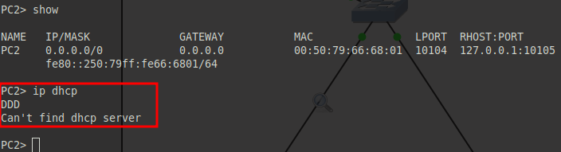

* * *

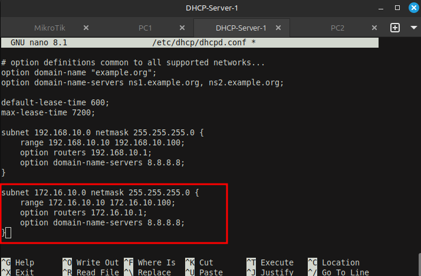

Пока сервер знает только сеть 192.168.10.0/24, Relay «доставит» Discover до сервера, но сервер не сможет выдать адрес, и клиент останется без IP. Поэтому перед запуском Relay нужно добавить новую подсеть в конфигурацию DHCP-сервера (/etc/dhcp/dhcpd.conf):

* * *

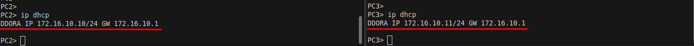

* * *

PC1 и PC2 получили адреса. Анализируем DHCP Offer для клиента PC2. Сам сервер Ubuntu хочет выдать клиенту адрес из своего пула в первой подсети, но клиент находится во второй подсети 172.16.10.0/24. Пакет до клиента доходит через MikroTik, который выступает как DHCP Relay. Маршрутизатор подставляет в качестве источника свой локальный IP 172.16.10.1, чтобы пакет корректно дошёл до клиента, у которого нет прямого маршрута к серверу. Назначение пакета — IP 172.16.10.10, который сервер предлагает клиенту. В поле Next Server IP Address остаётся 192.168.10.2, показывая, что реальный DHCP-сервер находится в первой подсети. То есть пакет визуально идёт «от» MikroTik, но фактически это предложение от Ubuntu-сервера, и такой механизм позволяет клиенту в изолированной подсети получить IP-адрес и сетевые параметры.

* * *

#### 3. Как пакеты проходят через Relay (разбор по шагам)**

*   **Шаг 1: Discover от клиента (PC2/PC3)**  
    Клиент из подсети 172.16.10.0/24 отправляет DHCP Discover широковещательно (`ff:ff:ff:ff:ff:ff`). Он ищет любой DHCP-сервер. Но так как сервер находится в другой подсети, пакет не дойдёт напрямую.
    
*   **Шаг 2: Перехват пакета MikroTik**  
    DHCP Relay на MikroTik «ловит» этот Discover на ether2. Relay читает пакет и подставляет в него новый IP-адрес назначения — IP DHCP-сервера (192.168.10.2). Пакет теперь отправляется как unicast от MikroTik к серверу.
    
*   **Шаг 3: Сервер получает Discover**  
    DHCP-сервер Ubuntu получает пакет. Пока что сервер знает только пул для 192.168.10.0/24, поэтому он не может выдать адрес для 172.16.10.0/24. Relay при желании может добавить опцию 82 (Agent Information), чтобы сервер понял, из какой подсети пришёл клиент и какой пул использовать.
    
*   **Шаг 4: Offer от сервера**  
    Сервер формирует DHCP Offer для клиента. Если пул для 172.16.10.0/24 уже добавлен, сервер выбирает свободный IP из этого пула и отправляет пакет обратно на IP, с которого пришёл Discover (MikroTik).
    
*   **Шаг 5: MikroTik доставляет Offer клиенту**  
    Когда пакет возвращается на MikroTik, он меняет IP-адрес источника на свой интерфейс в клиентской подсети (172.16.10.1), чтобы клиент мог принять ответ, и пересылает Offer клиенту.
    
*   **Шаг 6: Request и ACK**  
    Клиент отвечает DHCP Request, сервер подтверждает DHCP ACK — весь процесс DORA полностью проходит через Relay. Клиент получает IP-адрес, шлюз и DNS, как будто сервер находится в его подсети.
