# Развертывание Windows Server и настройка первого доменного контроллера Active Directory. Часть 1.

В этой инструкции мы развернем Windows Server и настроим его как первый контроллер домена. Контроллер домена управляет сетевой инфраструктурой, обеспечивая безопасный доступ и хранение данных о пользователях, группах, компьютерах и других устройствах. 

Active Directory - это служба каталогов, которая централизованно управляет сетью, хранит информацию об объектах, контролирует безопасность и помогает администрировать компьютеры и пользователей. Важно понимать ключевые понятия Active Directory:

- Домен - логическая единица сети, которая объединяет пользователей, компьютеры и объекты под общими правилами безопасности. Все пользователи домена имеют общую базу данных, управляемую контроллером домена.

- Лес - это один или несколько доменов, объединенных в иерархию. Домены доверяют друг другу и обмениваются информацией. 

Первый контроллер домена создает корневой домен леса, а затем можно добавлять дочерние домены. Создание первого контроллера домена – ключевой шаг, формирующий структуру нового леса, создающий базовые службы Active Directory и настраивающий права доступа. Без него невозможно развернуть домен или добавить серверы в инфраструктуру. 

В инструкции по шагам описана подготовка сервера и его настройка: 
1. Создание виртуальной машины. 
2. Установка Windows Server.
3. Начальная настройка сервера.
4. Установка нужных серверных ролей.
5. Повышение сервера до контроллера домена.

* * *

## 1. Создание виртуальной машины

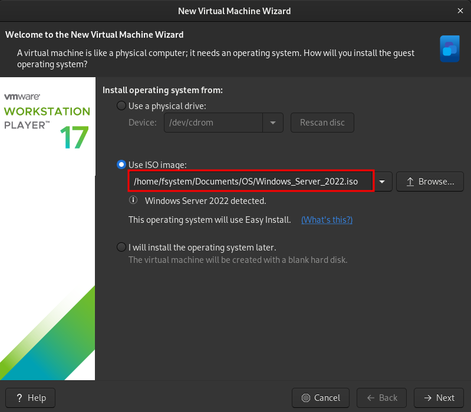

Для моей работы я воспользуюсь VMware Workstation Player. В программе создам новую виртуальную машину и укажу её параметры

* * * 

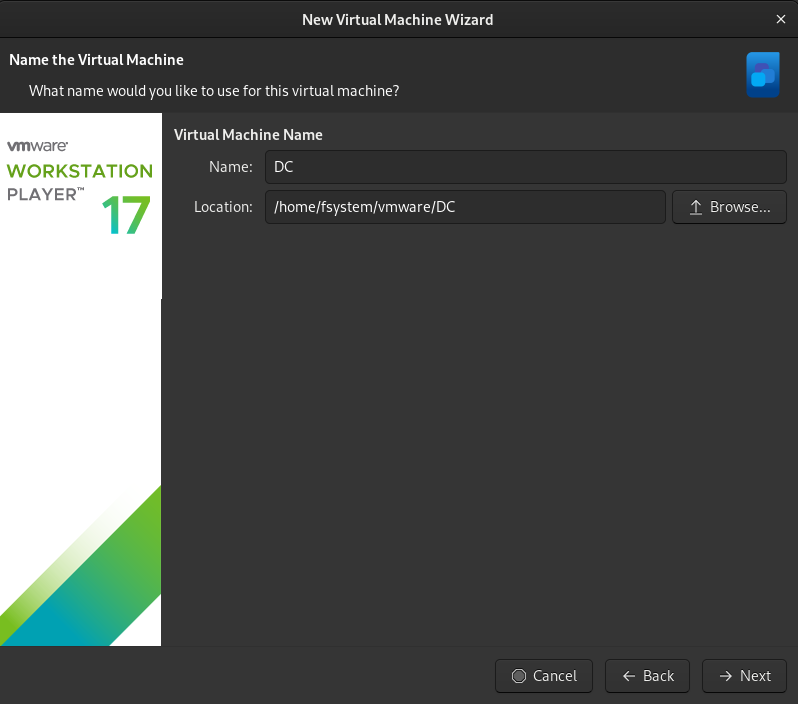

Имя виртуальной машины: DC (Domain Controller)

* * * 

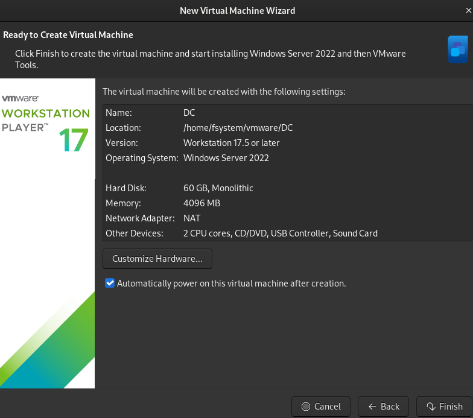

После проверки всех параметров нажму кнопку Finish, чтобы завершить создание виртуальной машины. Виртуальная машина готова к установке Windows Server.

* * * 

## 2. Установка Windows Server

* * *

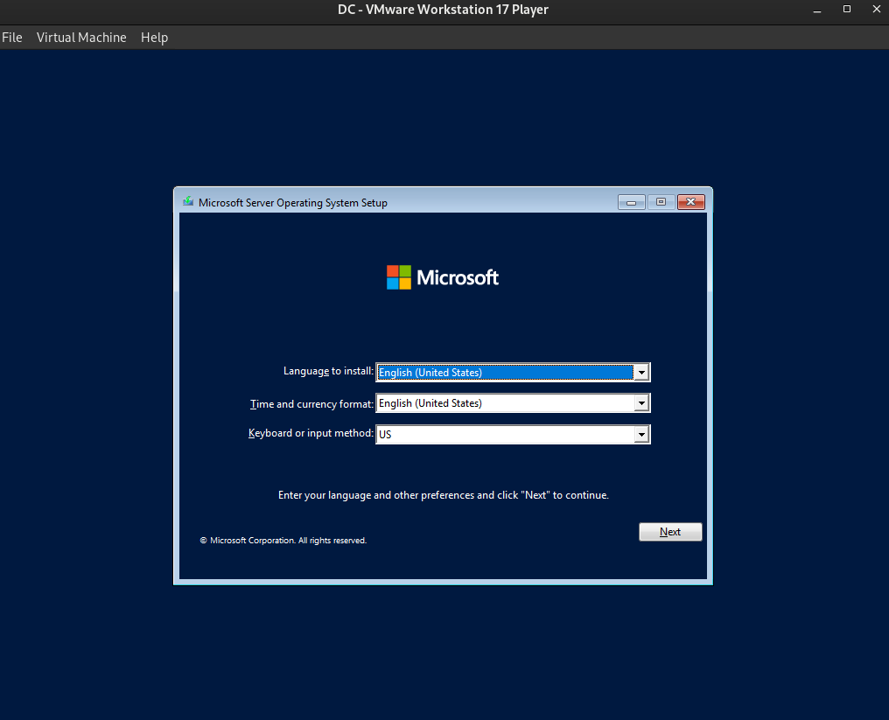

На первом этапе установки нужно выбрать язык, формат времени и раскладку клавиатуры.

* * * 

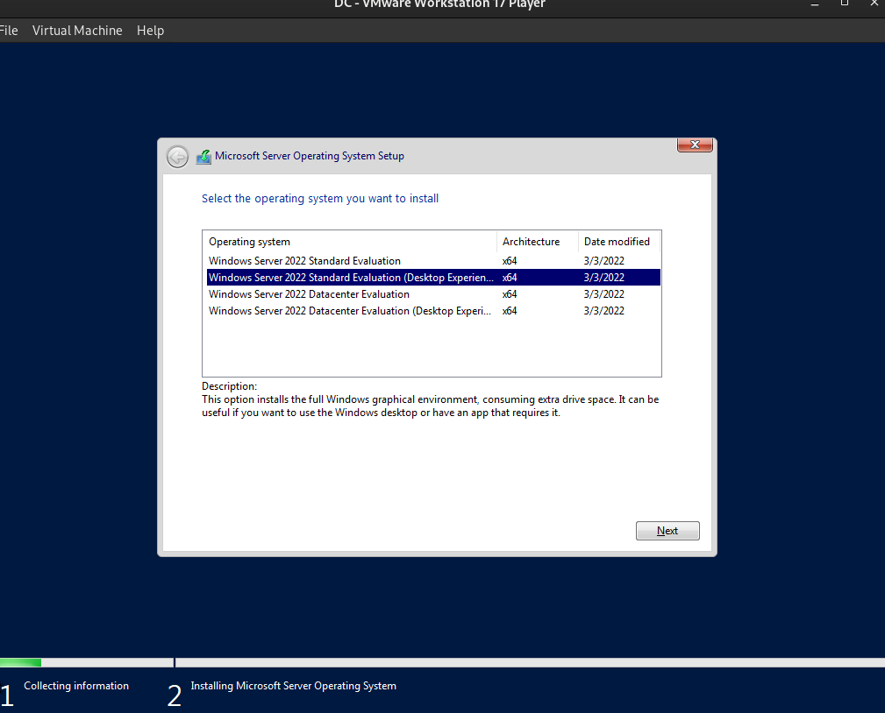

При установке системы нужно выбрать редакцию. Standard или Datacenter. 

- Standard - предназначена для стандартных серверных задач и малых/средних организаций. Позволяет устанавливать все основные роли сервера, включая Active Directory, DNS, DHCP, File Server и другие. Поддерживает ограниченное количество виртуальных машин (обычно до 2 на физический сервер, если использовать гипервизор). Идеально подходит для учебных целей, тестирования или небольших сетей.

- Datacenter - предназначена для крупных корпоративных сред и центров обработки данных. Поддерживает неограниченное количество виртуальных машин на одном физическом сервере. Включает все возможности Standard, плюс дополнительные функции для виртуализации и защиты, например Software-Defined Networking (SDN), расширенные функции Storage Spaces Direct и Shielded VMs. Используется в крупных инфраструктурах, где планируется большое количество виртуальных серверов и продвинутая виртуализация.

* * * 

## 3. Начальная настройка сервера

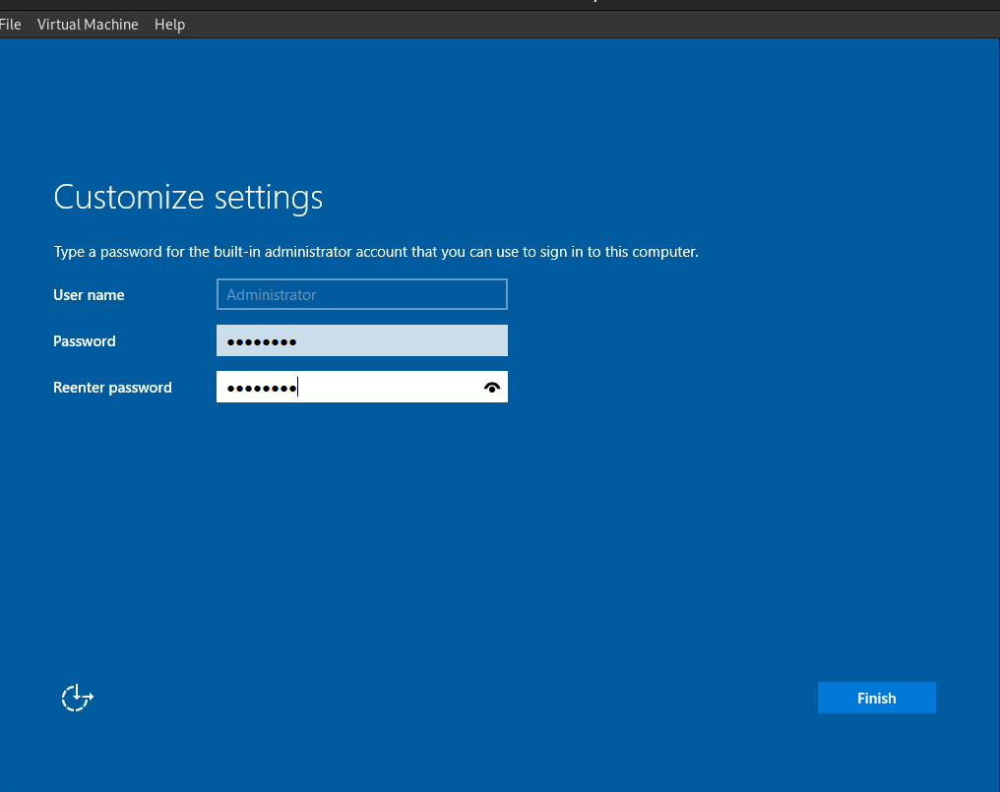

После установки я сразу же создаем встроенную учётную запись администратора с надежным паролем. Она нужна для управления сервером.

* * * 

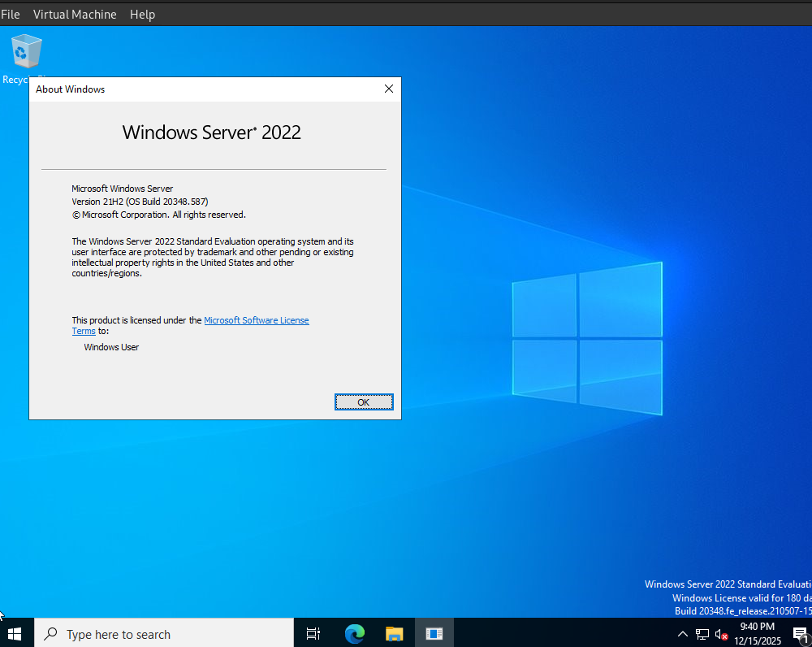

Сперва убедимся, что у вас установлена правильная версия Windows Server. Просто запустить команду winver и посмотреть, что отображается. Там должно быть указано Windows Server 2022 Standard Evaluation и номер сборки.

* * * 

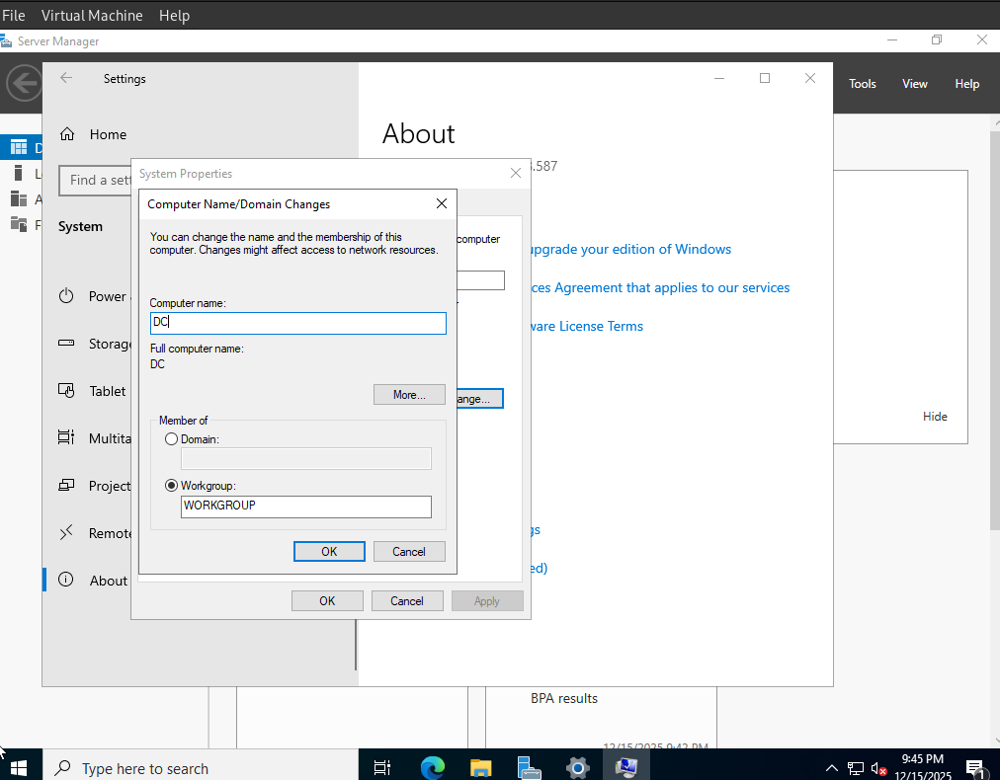

По умолчанию Windows даёт серверу случайное имя, что не очень удобно. Чтобы упростить работу, лучше его сразу поменять.

Открываем свойства системы и переходим в раздел, где можно изменить имя компьютера. В качестве нового имени указываем DC (Domain Controller). Имя DC позволит легко находить этот сервер в сети и пригодится при настройке домена. После смены имени потребуется перезагрузка, чтобы изменения вступили в силу.

* * * 

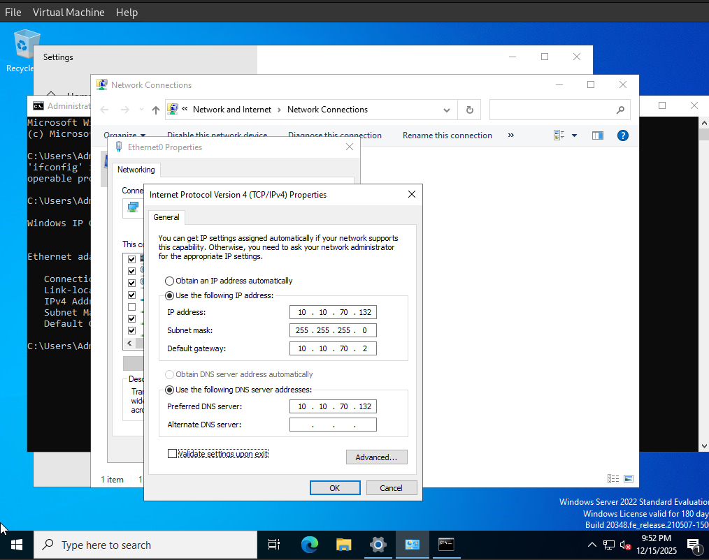

Первым делом, нужно проверить, что с сетевой картой всё в порядке и что у сервера есть постоянный ip. Тут у меня сеть настроена через NAT, так что сервер получает ip от DHCP. Но для контроллера домена это не годится, потому что Active Directory, DNS и DHCP должны работать со стабильным ip.

Статический ip нужен, чтобы домен работал без сбоев, например,если ip изменится, компьютеры и серверы не смогут найти контроллер домена. Это вызовет проблемы при входе в систему и доступе к файлам. Для DNS-служб, Active Directory и DNS работают вместе, например, если ip-адрес контроллера домена поменяется, записи в DNS будут неправильными, и клиенты не смогут находить нужные имена в сети. Для DHCP и маршрутизации, например, со статическим ip проще настроить выдачу ip клиентам и настроить маршруты в сети, чтобы сервер всегда был доступен.

Для настройки статического ip адреса открываем параметры сети на сервере. переходим к нужному адаптеру, открываем Свойства и выбираем Протокол версии 4 (TCP/IPv4).

В поле DNS-сервер вписываем локальный ip сервера (который только что настроили как статический). Это важно, чтобы контроллер домена выполняет роль DNS-сервера для сети. Клиенты и серверы будут использовать его, чтобы узнавать имена внутри домена. Если указать другой DNS, сервер не сможет правильно находить записи Active Directory, и Active Directory будет работать с ошибками.

* * * 

## 4. Установка серверных ролей

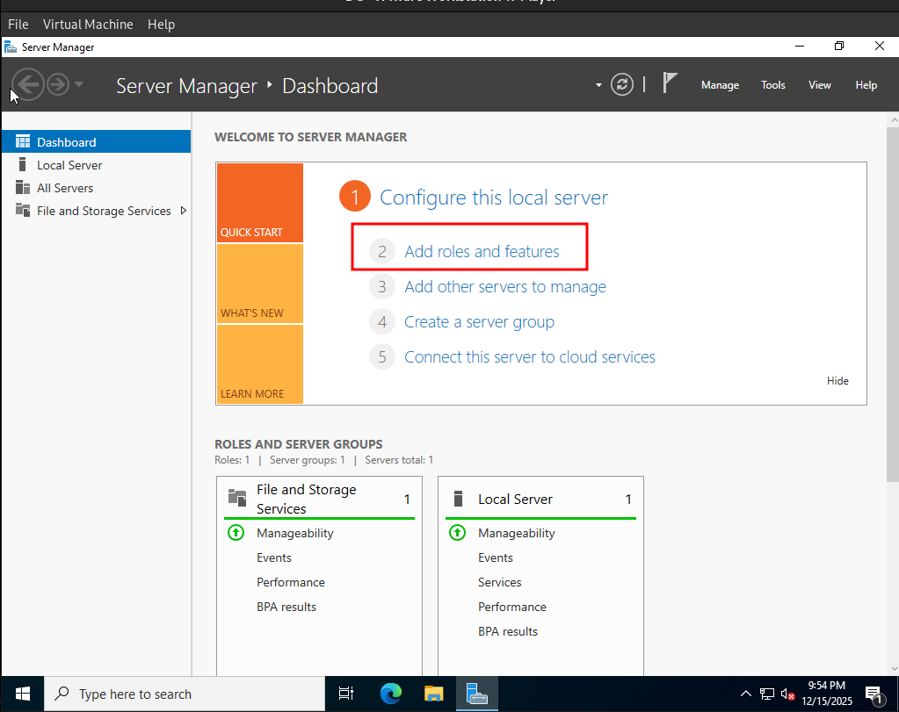

После того как сервер настроен и имеет статический IP-адрес, можно переходить к установке ролей, которые понадобятся для работы доменного контроллера. Все настройки выполняются через Server Manager. 
В Server Manager на панели управления выбираем Add roles and features. Открывается мастер установки ролей, который пошагово проведёт нас через весь процесс.

* * * 

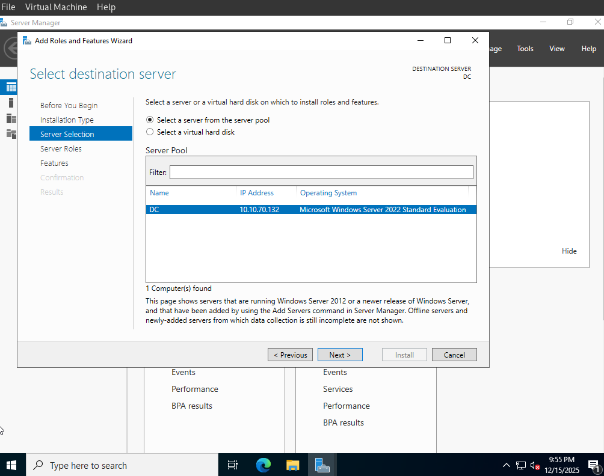

Выбираем наш сервер (DC) в качестве целевого для установки ролей. Проверяем, что выбран правильный сервер и ip совпадает с тем, который мы назначили статически.

* * * 

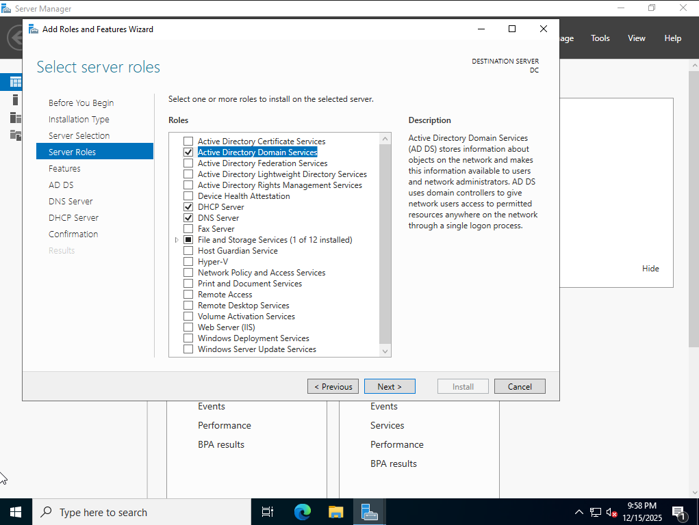

Для превращения сервера в доменный контроллер нам нужны следующие роли:

- Active Directory Domain Services (AD DS)
  - Основная служба, которая позволяет создавать домены, управлять пользователями, группами, компьютерами и политиками безопасности. После установки роли сервер станет способным выполнять функцию доменного контроллера.

- DNS Server
  - DNS нужен для работы Active Directory, так как все имена компьютеров и доменов должны разрешаться в IP-адреса. На этом сервере DNS будет обслуживать локальный домен, поэтому в качестве DNS-сервера мы указываем его же.

- DHCP Server
  - DHCP отвечает за автоматическую выдачу сетевых параметров клиентским устройствам в сети. Устанавливается для того, чтобы тестовые клиенты могли получать адреса автоматически и корректно подключаться к домену.

* * * 

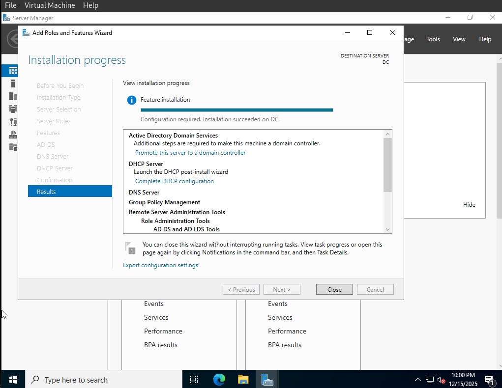

После установки Server Manager покажет уведомления о том, что некоторые роли требуют послеустановочной конфигурации. Для AD DS это повышение сервера до доменного контроллера. Для DHCP это настройка диапазона выдачи адресов и активация службы.

* * * 

## 5. Повышение сервера до доменного контроллера

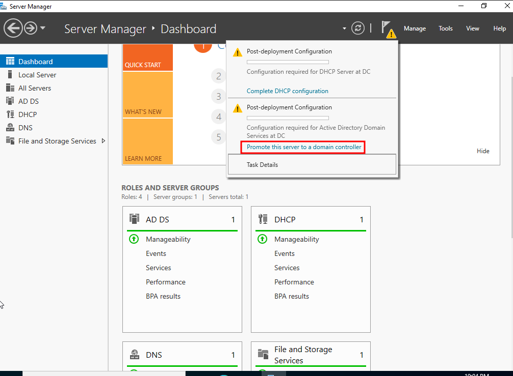

После установки ролей Active Directory Domain Services (AD DS) и DNS Server сервер готов стать доменным контроллером. Этот процесс называют "повышением" (promotion). Он необходим, чтобы сервер начал управлять доменом, пользователями, компьютерами и другими объектами сети.

* * * 

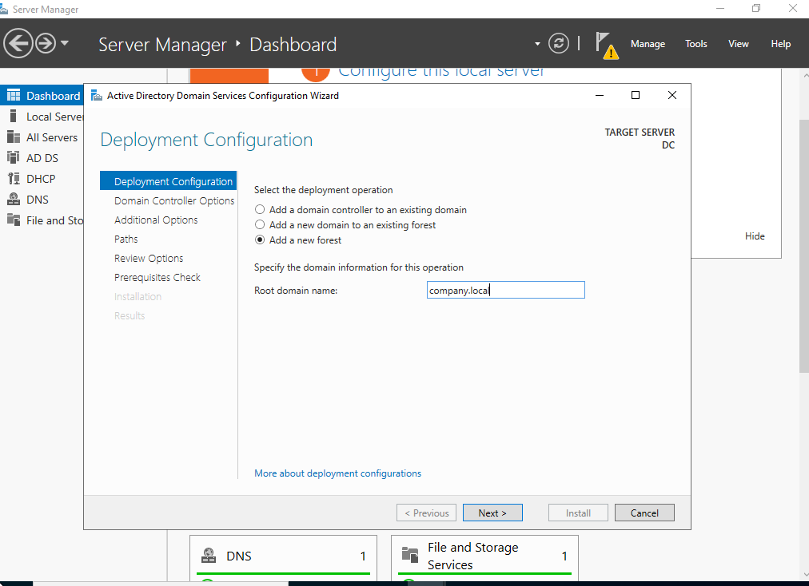

В Server Manager в правом верхнем углу появляется уведомление о необходимости послеустановочной настройки AD DS. Нажимаем Promote this server to a domain controller. Открывается Active Directory Domain Services Configuration Wizard, который проведёт нас через все этапы настройки.

Тут предлагает несколько вариантов:

- Add a domain controller to an existing domain - добавить сервер в уже существующий домен.
- Add a new domain to an existing forest - создать новый домен в существующем лесу.
- Add a new forest - создать полностью новый лес и корневой домен.

Поскольку это первый сервер и домена ещё нет, выбираем Add a new forest.

Вводим имя будущего домена, например, company.local. Это имя будет использоваться для всех объектов внутри домена, включая пользователей, компьютеры и службы. Оно должно быть уникальным в сети и соответствовать стандартам DNS.

* * * 

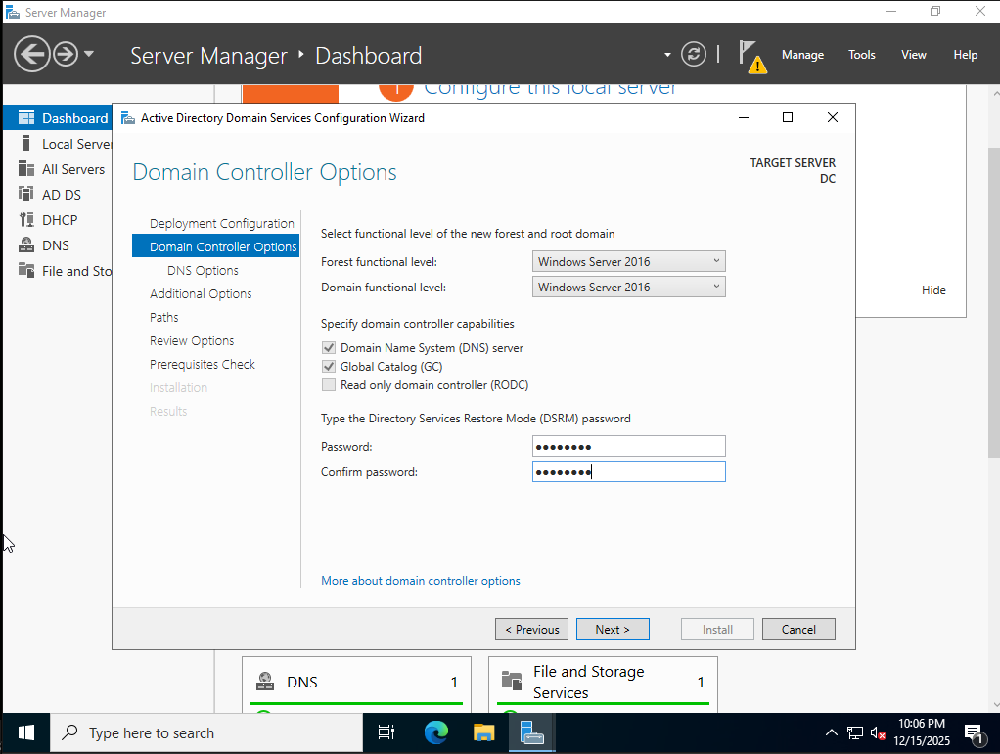

Forest functional level - выбираем минимальный уровень, который поддерживает все нужные функции, например Windows Server 2016.

Domain functional level - также Windows Server 2016.

Функциональный уровень определяет, какие возможности Active Directory будут доступны. Например, более новые уровни позволяют использовать современные функции безопасности и управления.

DNS Server - ставим галочку, чтобы сервер автоматически стал локальным DNS для домена.

Global Catalog (GC) - обязательно для первого доменного контроллера, нужен для поиска объектов в лесу.

Read-only domain controller (RODC) - не отмечаем, так как это первый контроллер.

Directory Services Restore Mode (DSRM) - пароль для аварийного восстановления службы каталогов. Он нужен, если нужно восстановить AD в случае проблем. Пароль должен быть надёжным и отличаться от обычного пароля администратора.

* * * 

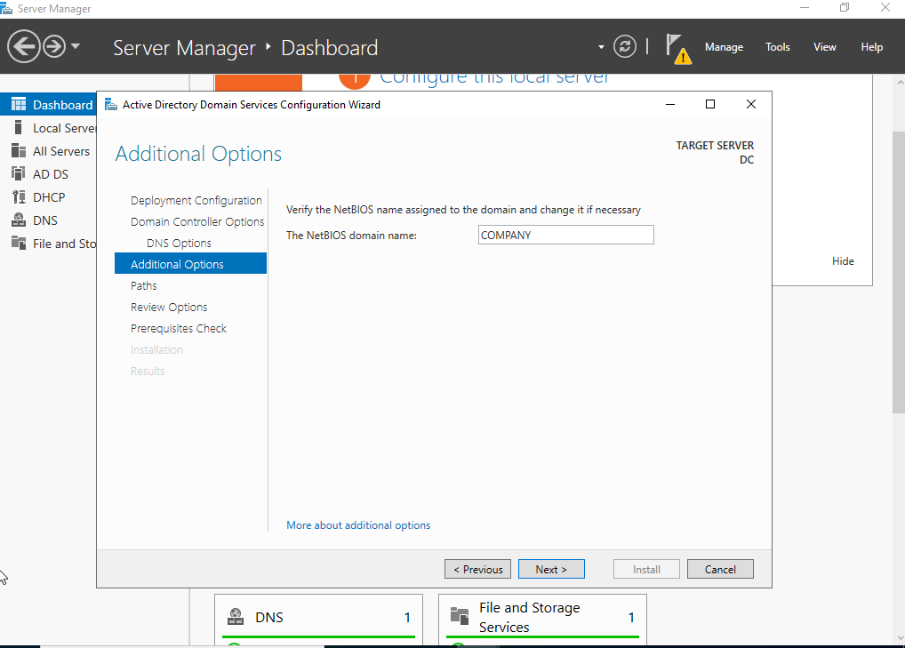

NetBIOS это формальная проверка, которая обеспечивает совместимость со старыми сетевыми протоколами и приложениями. Для современных систем основным остаётся DNS-имя домена, а NetBIOS служит как "резервная" система имён.

* * * 

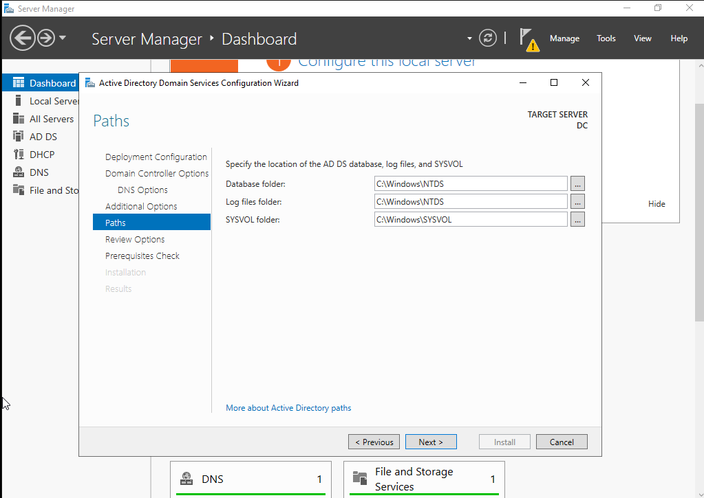

После выбора путей мастер завершает проверку настроек и готов к финальному этапу повышения сервера до доменного контроллера.

* * * 

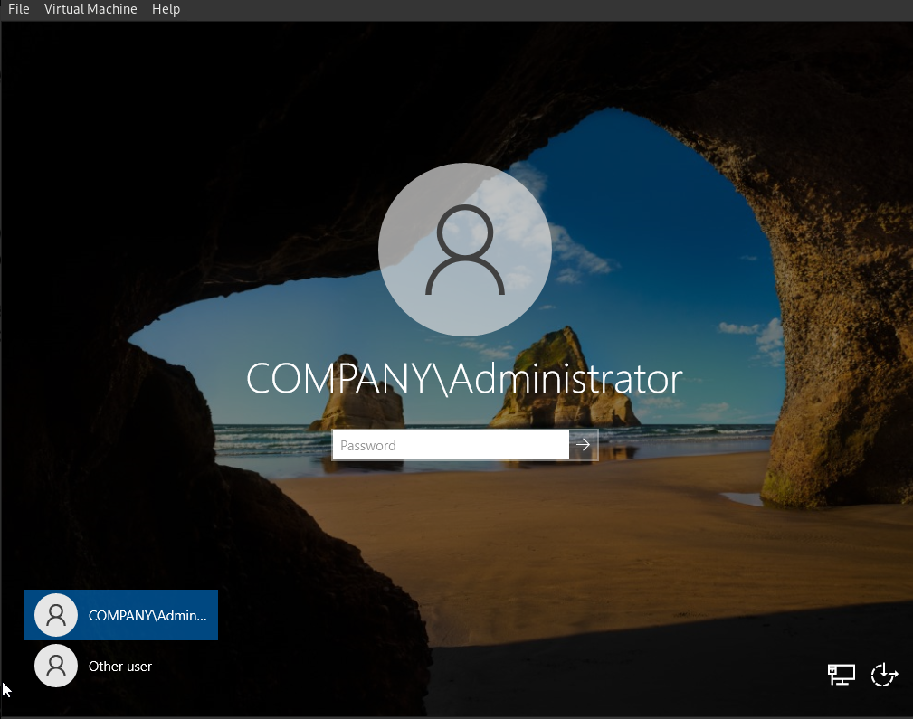

После перезагрузки сервер становится корневым доменным контроллером нового леса Active Directory. Теперь он выполняет функции управления доменом, авторизации пользователей, управления группами и политиками, а также обслуживания локального DNS.
