# Развертывание и настройка DNS-сервера в доменной среде. Часть 2

В первой части мы выполнили первоначальную настройку сервера. Была создана виртуальная машина, установлена Windows Server 2022, заданы основные параметры, назначен статический IP-адрес. Также установили нужные роли сервера и сделали его первым контроллером домена в новом лесу [Active Directory.](https://github.com/mnuryyev/handson-projects/blob/main/os/windows-ad/01_ad-installation/README.md)

В этой части посмотрим, как настраивать службу DNS (Domain Name System) в домене Active Directory. Без DNS домен нормально работать не будет, потому что именно через неё ищутся контроллеры домена, сетевые сервисы и другие важные вещи.  
  
В домене DNS не просто переводит имена в адреса, но и хранит данные Active Directory, которые нужны для входа пользователей, работы политик и связи между серверами и компьютерами.  
  
DNS и Active Directory связаны очень тесно. Когда делаешь сервер контроллером домена, DNS ставится сам, но его всё равно надо проверить и настроить, чтобы всё работало как надо.  
  
Что важно знать про DNS:  
  
- **DNS-зона** – это место, где хранятся записи доменных имён. Она показывает, какие имена и адреса обслуживает DNS-сервер.  
- **Прямая зона** нужна, чтобы имена переводить в IP-адреса, чтобы компьютеры могли найти серверы и сервисы по имени.    
- **Обратная зона** делает наоборот, переводит IP-адреса в имена. Это важно для проверки сети и работы некоторых сервисов.  

DNS-записи – это информация о сетевых объектах. Самые главные:  
  
- **A** – связывает имя и IP-адрес  
- **PTR** – связывает IP-адрес и имя  
- **SRV** – записи для Active Directory  
- **NS** – указывает на DNS-серверы зоны  
  
Целью второй части работы является настройка и проверка службы DNS в доменной среде. В рамках данной части будут выполнены следующие действия:

- проверка автоматически созданной прямой зоны DNS;
- создание и настройка обратной зоны DNS;
- проверка и создание необходимых DNS-записей;
- настройка сетевых параметров сервера для работы с локальным DNS;
- проверка корректности работы службы DNS. 

* * *

## 1. Проверка прямой зоны DNS (Forward Lookup Zone)

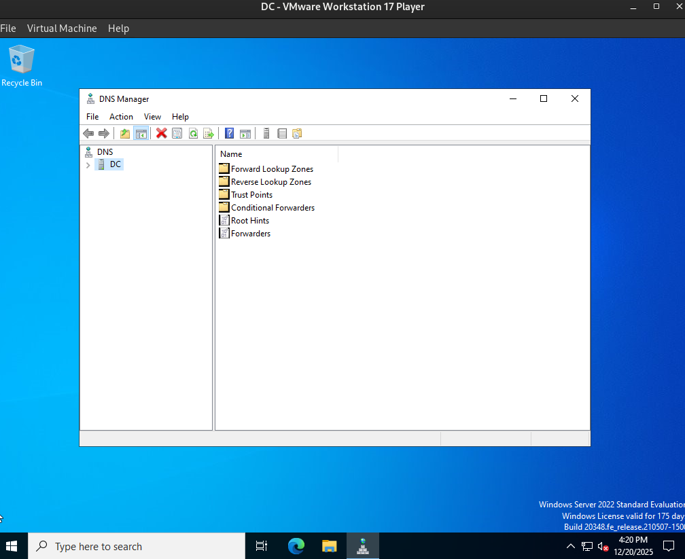

После повышения сервера до доменного контроллера служба DNS устанавливается и настраивается автоматически. На данном этапе необходимо убедиться, что прямая DNS-зона создана корректно и содержит все необходимые записи для работы Active Directory.

Для начала открываем консоль управления DNS: открываем Server Manager, в верхнем меню выбираем Tools, запускаем DNS.

В открывшемся окне DNS Manager отображается структура DNS-сервера. В левой части окна раскрываем имя сервера и переходим в раздел **Forward Lookup Zones**. В этом разделе должна присутствовать зона с именем домена, созданного при развертывании Active Directory. Наличие данной зоны означает, что DNS-сервер успешно интегрирован с доменной службой.

* * *

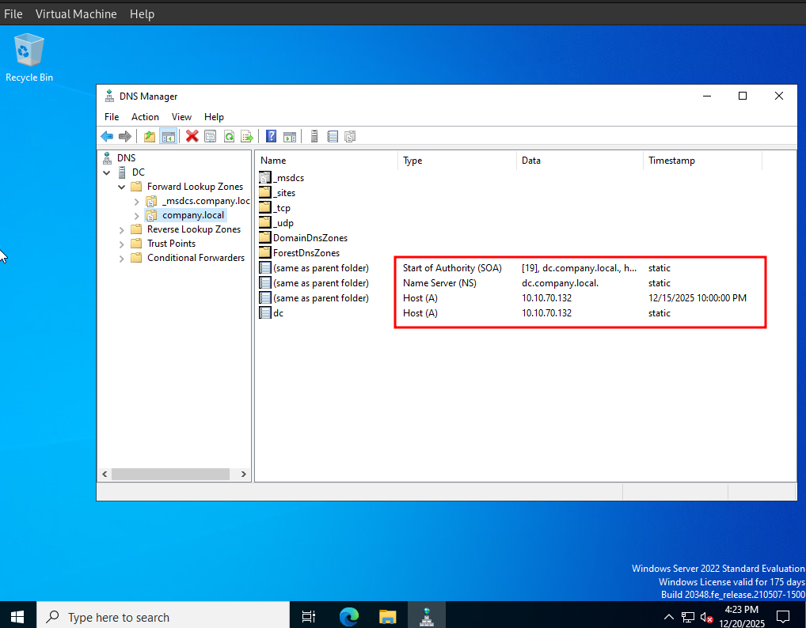

После открытия прямой зоны проверяем список DNS-записей.

- **SOA (Start of Authority)** это содержит информацию о зоне, основном DNS-сервере и параметрах обновления;
- **NS (Name Server)** это указывает DNS-серверы, обслуживающие данную зону;
- **A-запись** доменного контроллера это связывает имя сервера с его IP-адресом;

* * *

## 2. Создание обратной зоны DNS (Reverse Lookup Zone)

* * *

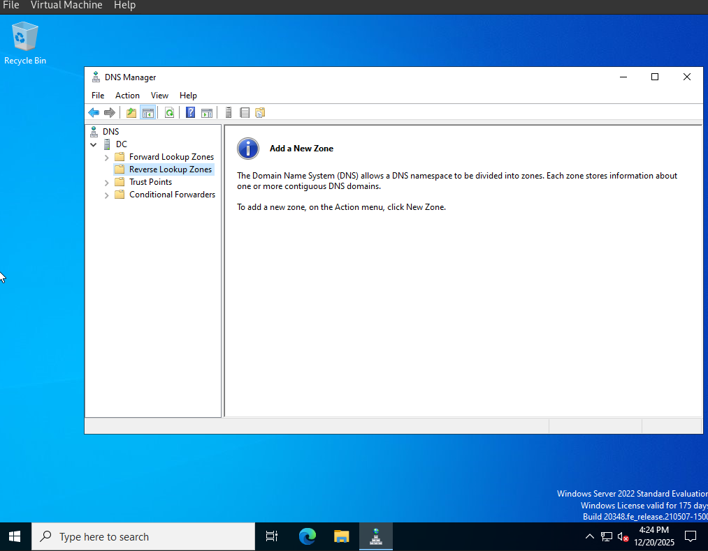

После проверки прямой зоны DNS необходимо создать и настроить обратную зону. Обратная зона используется для преобразования IP-адресов в доменные имена и играет важную роль при диагностике сети и работе некоторых сетевых служб. В отличие от прямой зоны, обратная зона не всегда создаётся автоматически, поэтому её наличие требуется проверить и при необходимости настроить вручную.

Для создания обратной зоны открываем DNS Manager и в левой части окна раскрываем имя сервера. Далее переходим в раздел **Reverse Lookup Zones**.

* * *

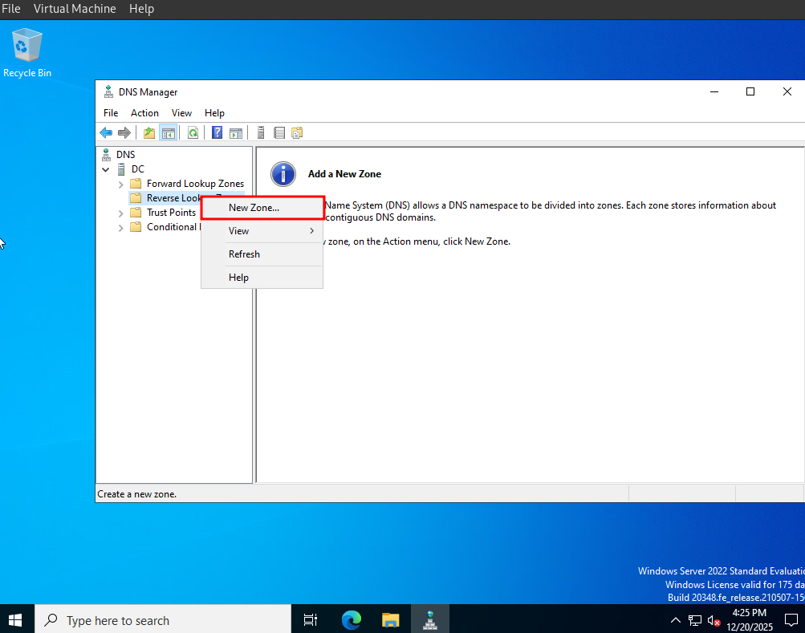

Для создания новой обратной зоны: нажимаем правой кнопкой мыши на раздел Reverse Lookup Zones, выбираем пункт New Zone, в открывшемся мастере создания зоны нажимаем Next.

* * *

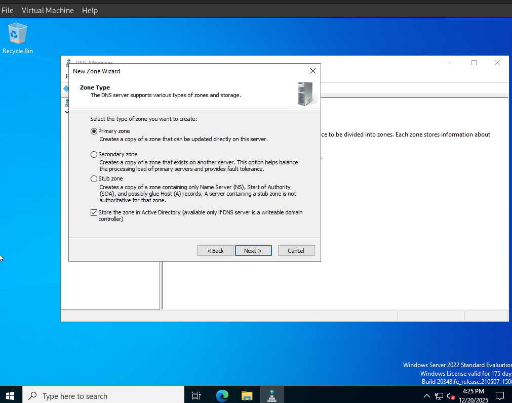

На этапе выбора типа зоны указываем Primary Zone и отмечаем параметр интеграции зоны с Active Directory. Это позволяет хранить данные зоны в базе Active Directory и автоматически реплицировать их между доменными контроллерами.

* * *

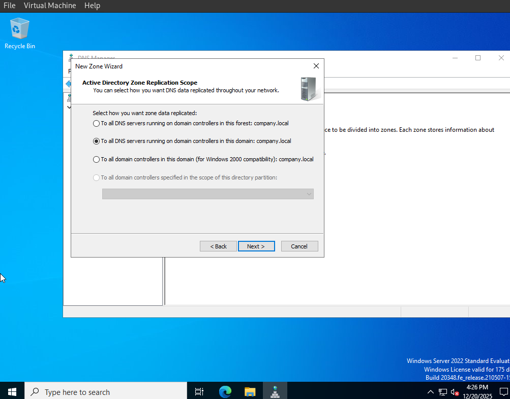

Далее выбираем область репликации зоны. Для доменной среды рекомендуется использовать репликацию для всех DNS-серверов в домене, что обеспечивает отказоустойчивость и согласованность данных.

* * *

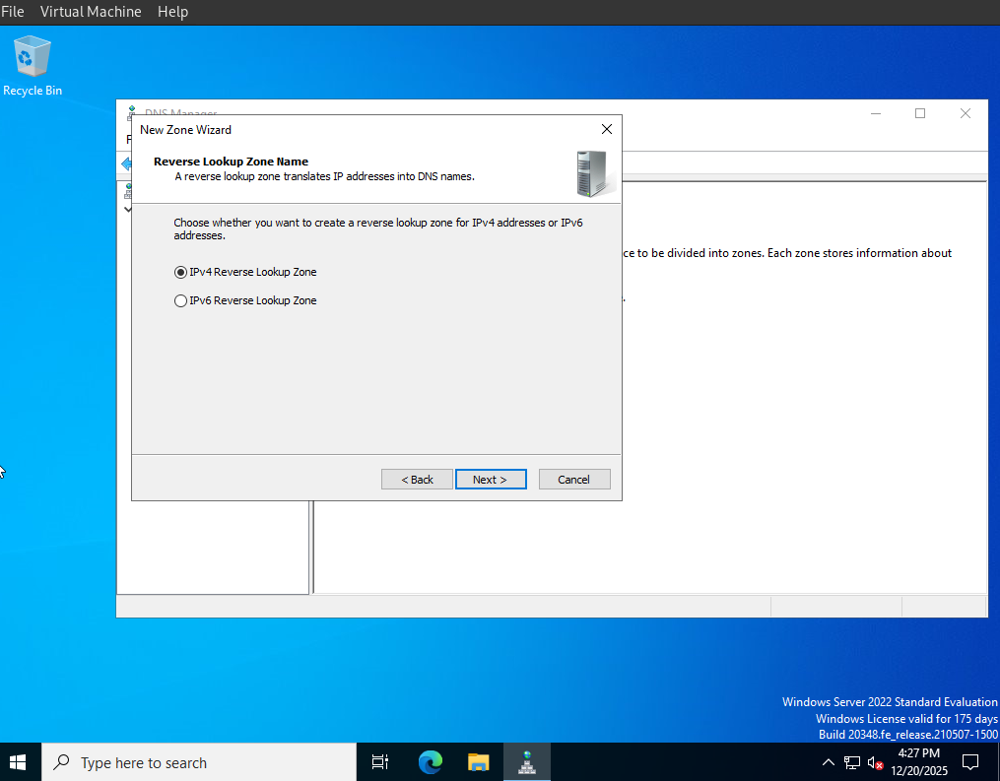

На следующем этапе выбираем тип IPv4, так как в данной работе используется IPv4-адресация. 

* * *

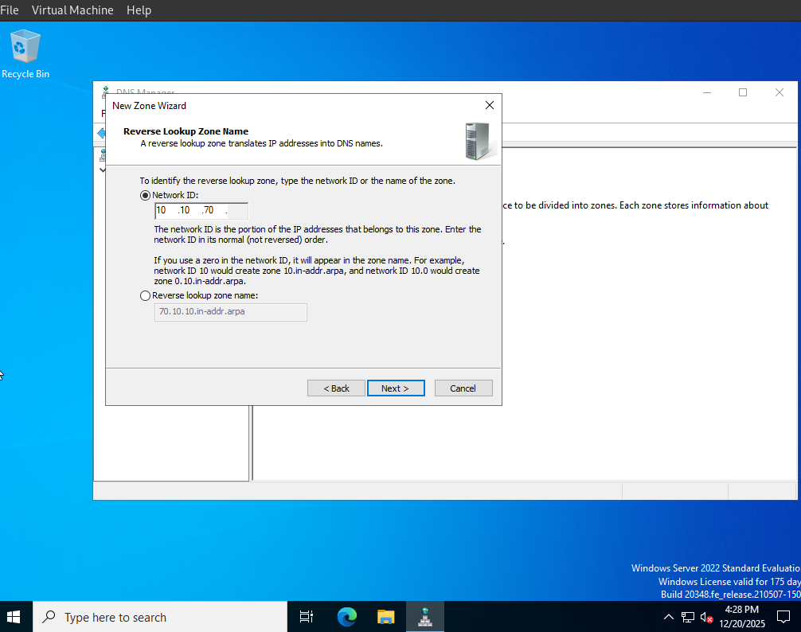

Указываем идентификатор сети, соответствующий IP-адресу сервера. Идентификатор сети формируется из первых трёх октетов IP-адреса.

* * *

На этапе настройки динамических обновлений выбираем параметр Allow only secure dynamic updates. Это позволяет разрешить автоматическое обновление DNS-записей только доверенным объектам домена, повышая безопасность инфраструктуры.

* * *

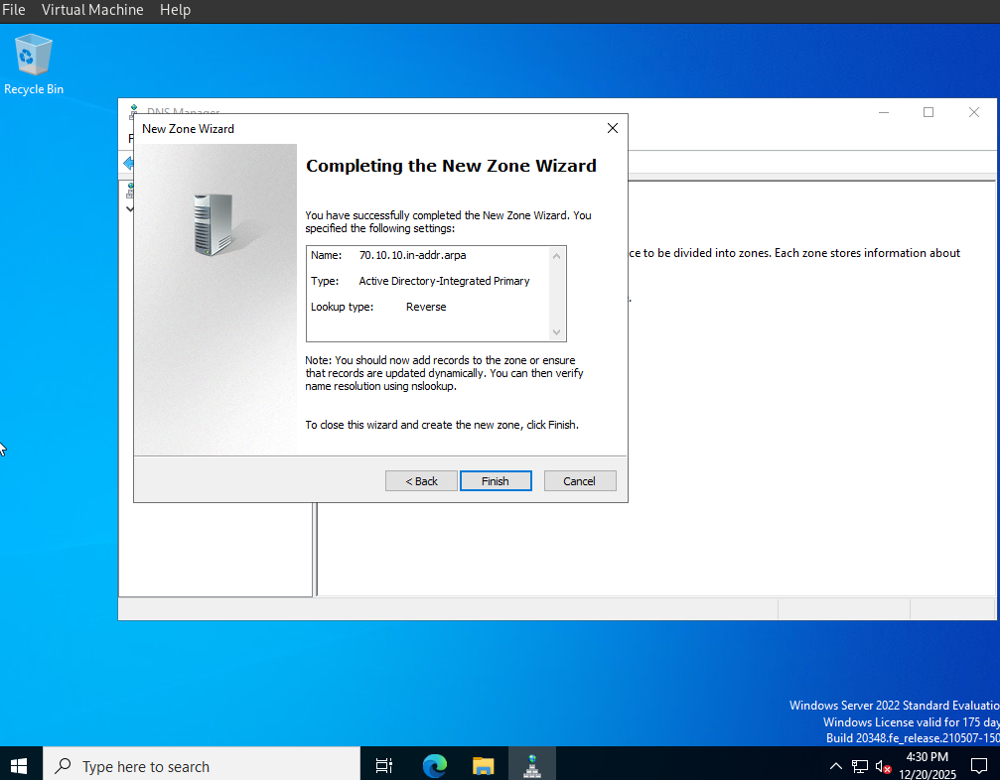

* * *

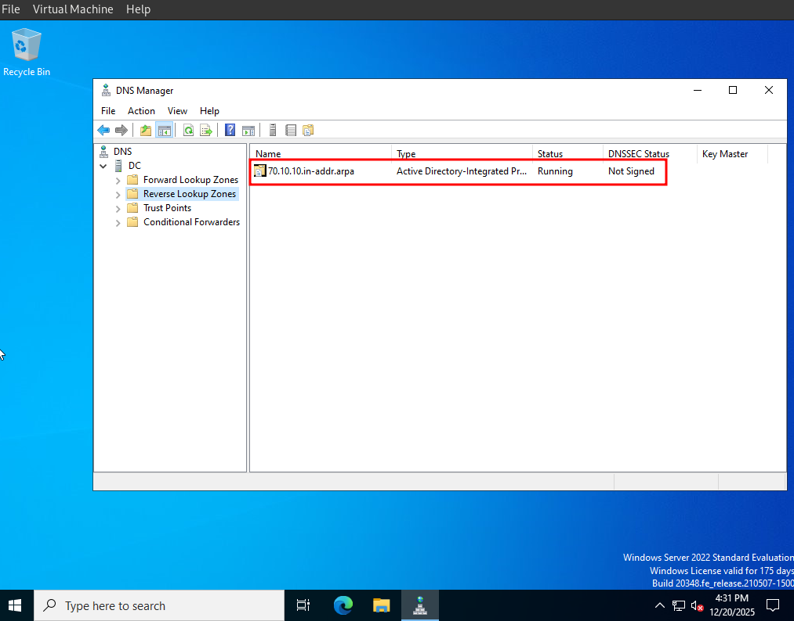

В разделе **Reverse Lookup Zones** появляется созданная обратная зона.

* * *

## 3. Проверка и создание PTR-записи для доменного контроллера

После создания обратной зоны DNS необходимо убедиться, что для доменного контроллера существует PTR-запись. PTR-запись используется для обратного разрешения имён, то есть позволяет определить доменное имя компьютера по его IP-адресу. Наличие корректной PTR-записи важно для диагностики сети и корректной работы отдельных служб и журналов событий.

Для проверки наличия PTR-записи открываем DNS Manager и в левой части окна раскрываем раздел Reverse Lookup Zones. Далее выбираем ранее созданную обратную зону. В правой части окна отображается список записей, относящихся к данной зоне.

В списке записей должна присутствовать запись типа PTR, в которой, в поле имени указана последняя часть IP-адреса сервера и полное доменное имя сервера. 

Если PTR-запись присутствует, это означает, что обратное разрешение имён для доменного контроллера настроено корректно. В моем случае PTR-записи отсутствует её необходимо создать вручную. 

* * *

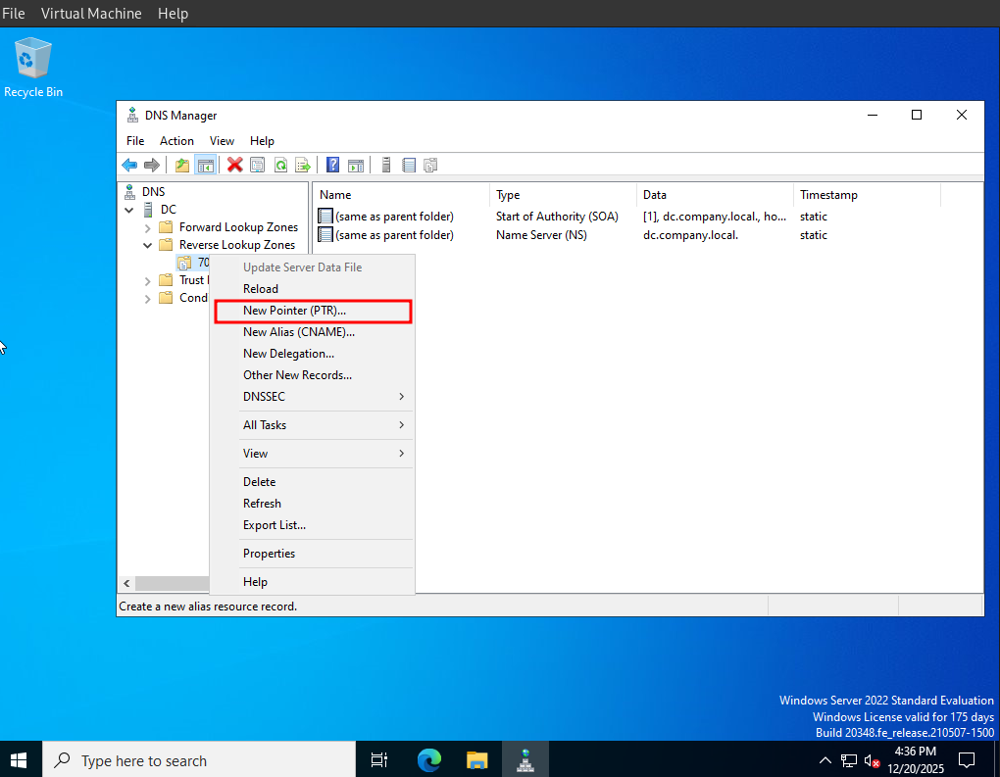

Для создания PTR-записи, нажимаем правой кнопкой мыши по нужной обратной зоне, выбираем пункт **New Pointer (PTR)**.

* * *

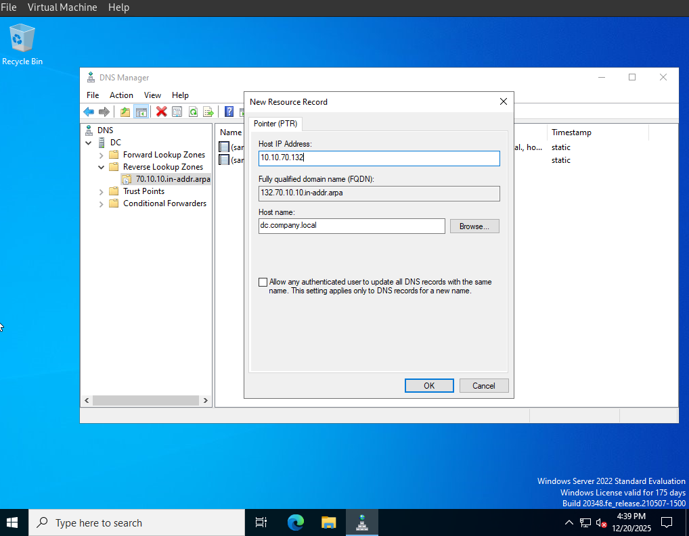

В поле Host IP number указываем последнюю часть IP-адреса сервера. В поле Host name указываем полное DNS-имя сервера и подтверждаем создание записи.

* * *

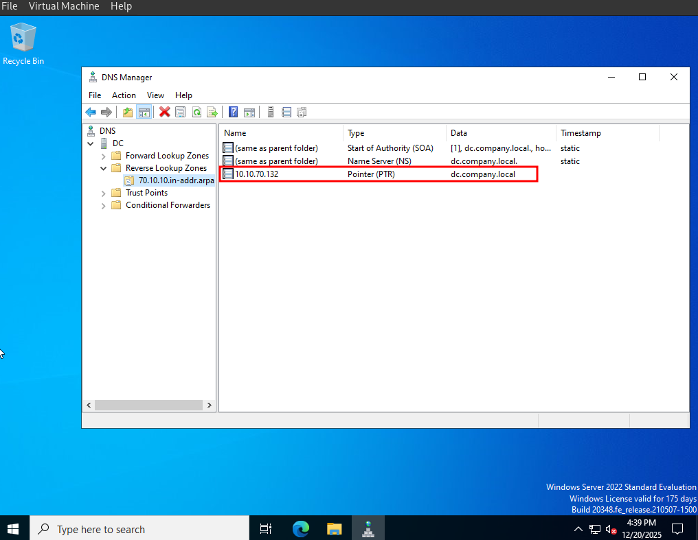

После выполнения этих действий PTR-запись появляется в списке записей обратной зоны.

* * *

## 4. Проверка работоспособности DNS-сервера

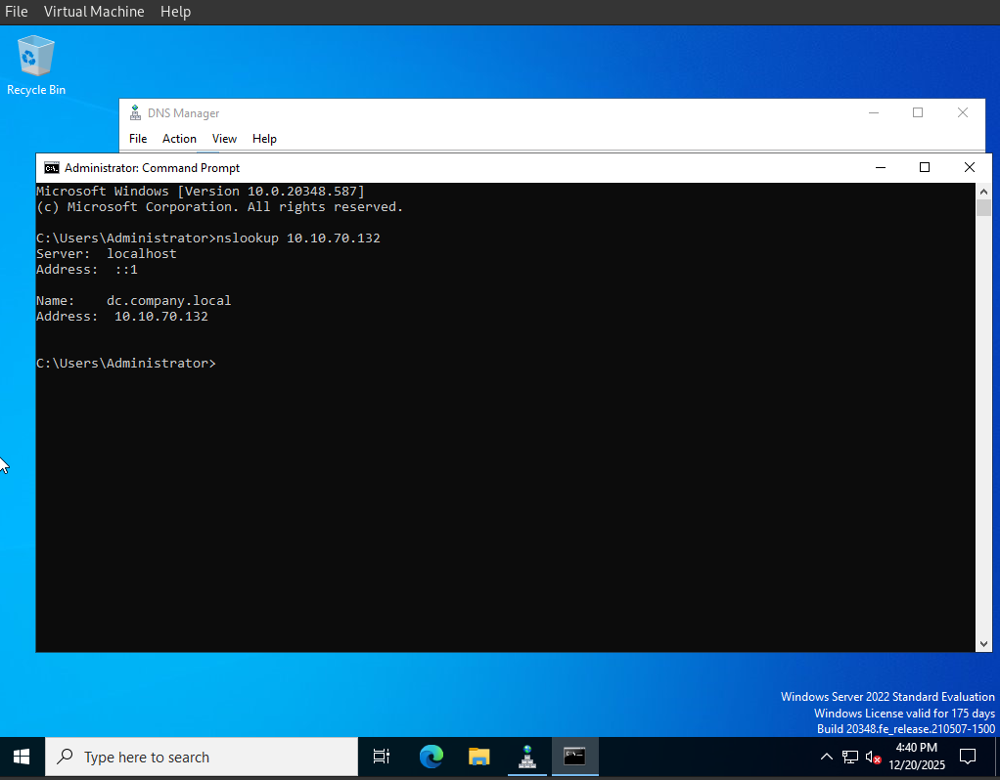

После настройки прямой и обратной зон DNS, создания PTR-записей и проверки сетевых параметров сервера необходимо убедиться, что служба DNS функционирует корректно. Для этого используем команду nslookup, указав IP-адрес сервера. В ответе отображается полное доменное имя сервера.
