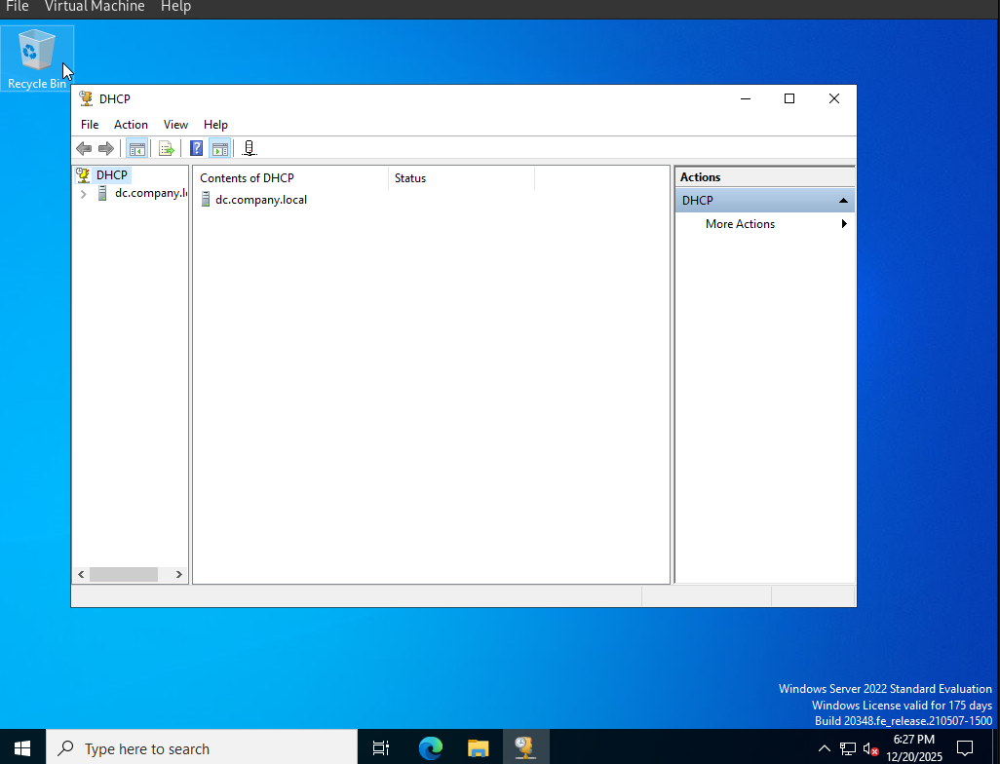
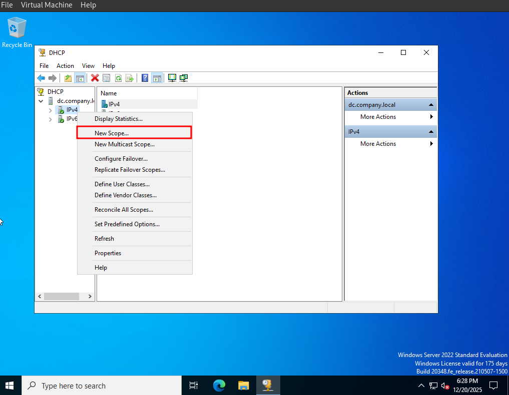
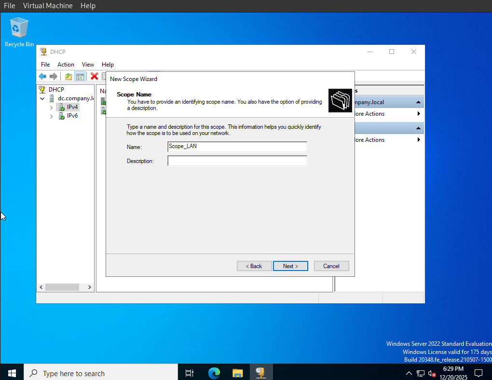
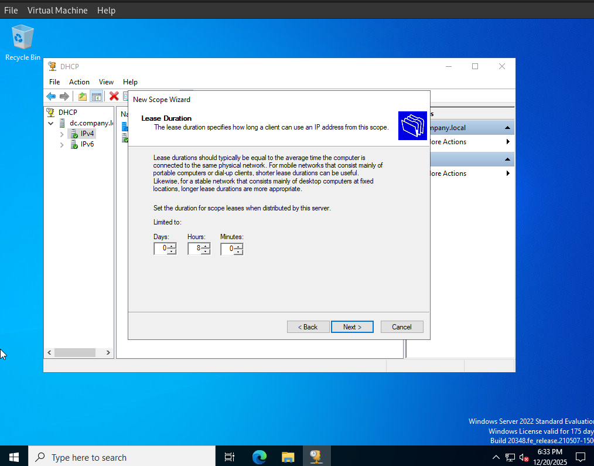
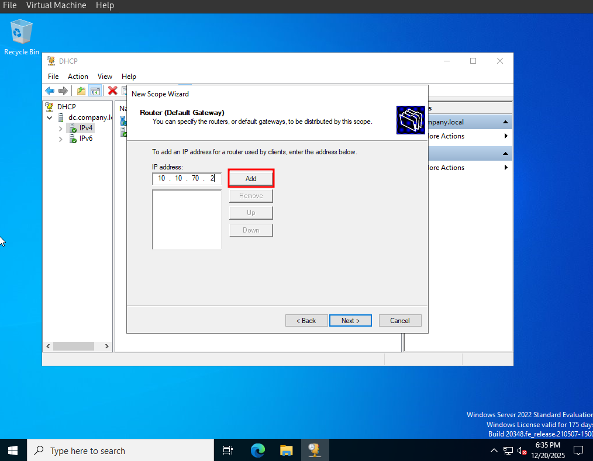
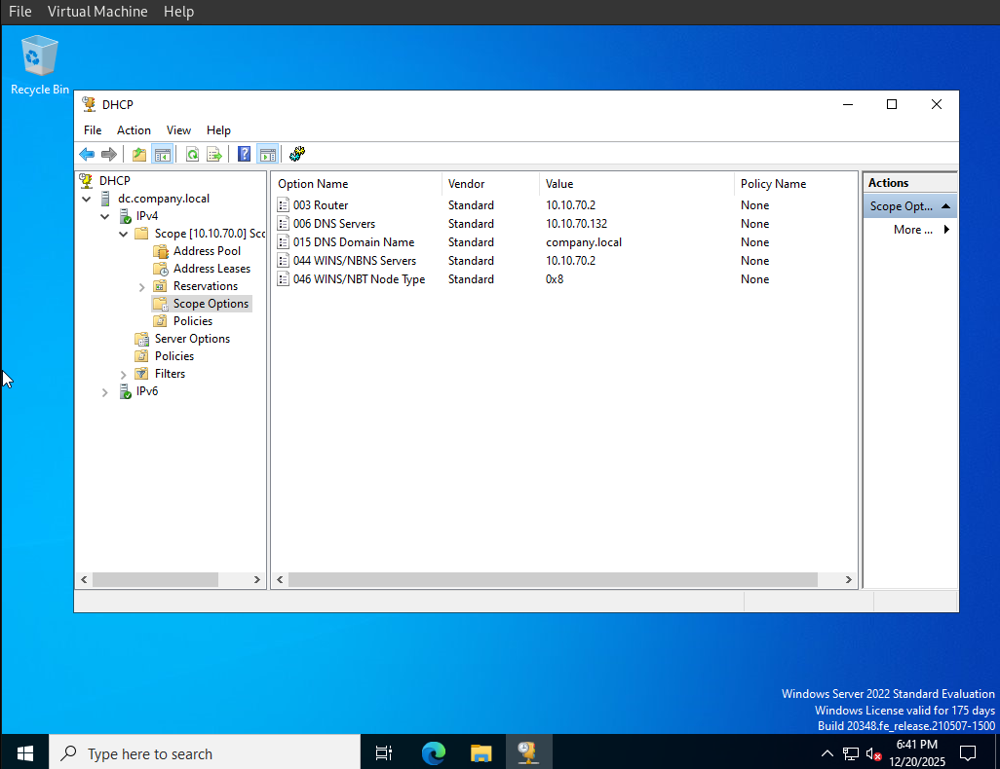

# Настройка DHCP-сервера. Часть 3.

В предыдущей части работы мы развернули и настроили [DNS-сервер](https://github.com/mnuryyev/handson-projects/blob/main/os/windows-ad/02_ad-dns/README.md), который обеспечивает прямое и обратное разрешение имён для доменного контроллера и клиентов.

Теперь переходим к настройке DHCP-сервера. DHCP(Dynamic Host Configuration Protocol) это служба, которая автоматически выдаёт IP-адреса и сетевые параметры клиентским компьютерам в сети. DHCP облегчает управление адресным пространством, предотвращает конфликты IP и обеспечивает, чтобы клиенты получали правильные значения для DNS и шлюза по умолчанию.

В доменной среде DHCP должен использовать локальный DNS-сервер, который мы настроили ранее, чтобы все клиенты корректно подключались к домену и могли разрешать имена доменных контроллеров.

Цель данной части работы:

- Установить и активировать DHCP-сервер;
- Создать пул адресов (Scope) для выдачи IP клиентам;
- Настроить параметры DHCP: Router (шлюз), DNS Servers и DNS Domain Name;

* * *

## 1. Создание пула адресов (Scope) и настройка опций DHCP

* * *

Переходим к установке и запуску роли DHCP Server на доменном контроллере. 

* * *

В DHCP Manager раскрываем сервер **IPv4**. Правой кнопкой мыши на **IPv4** нажимаем **New Scope**.

* * *

В открывшемся окне вводим параметры Scope, **Scope Name** * название пула, например Scope_LAN.

* * *

Настроим пул IP-адресов: 

- Начальный IP-адрес: 10.10.70.100
- Конечный IP-адрес: 10.10.70.200

Сервер станет распределять IP-адреса только в этом диапазоне. 

Маска подсети: /24, что соответствует 255.255.255.0. Она укажет, какие адреса принадлежат к локальной сети, а какие к другим подсетям. 

* * *

Здесь указываются адреса, которые DHCP не должен выдавать. Как правило, это IP-адреса серверов, маршрутизаторов, принтеров и другого важного оборудования. 

* * *

lease это время, на которое устройство получает IP-адрес. 

Для офисов и серверов, где устройства обычно не меняются, лучше установить срок от 1 до 7 дней. Так DHCP-сервер будет работать стабильнее, и нагрузка на него уменьшится.

* * *

Шлюз – это, как правило, маршрутизатор, через который наши компы в сети выходят за её пределы. Если компу нужно отправить данные куда-то ещё, в другую сеть или в интернет, трафик идёт через этот шлюз. Без него устройства смогут общаться только внутри своей сети и не смогут выйти наружу. 

В настройках DHCP мы указываем IP-адрес раздающего маршрутизатора. У нас это 10.10.70.2. Когда новый комп подключается к сети, он получает не только IP, но и шлюз, и сразу работает везде без дополнительных настроек.

Указание шлюза через DHCP упрощает работу. Если маршрутизатор поменяется, достаточно поправить настройку на сервере, и все клиенты получат новый шлюз автоматически. Это важно для больших сетей, где много компов должны нормально подключаться к сети и интернету.

* * *

Чтобы DHCP работал как надо, важно сразу указать домен, имя сервера и его IP. Домен (вроде company.local) нужен, чтобы все устройства в сети понимали, к чему подключаться для получения настроек и доступа к общим ресурсам. Имя сервера (например, DC) помогает понять, какой именно сервер раздает IP-адреса и отвечает за домен. А IP-адрес (типа 10.10.70.132) говорит клиентам, где искать DNS-сервер для правильного определения имен и подключения к контроллеру домена. Все это нужно, чтобы DHCP в сети нормально функционировал и клиенты автоматически получали нужные настройки.

* * *

Scope Options в DHCP определяют дополнительные параметры, которые сервер автоматически передаёт клиентским устройствам вместе с IP-адресом. Сюда входят основной шлюз (Router), который указывает путь для выхода за пределы локальной сети, DNS-серверы для разрешения имён в IP-адреса, имя домена (DNS Domain Name), а также устаревшие параметры, такие как WINS-серверы и тип узла NetBIOS. Настройка этих опций позволяет клиентам сразу правильно подключаться к сети, использовать доменные ресурсы и корректно разрешать имена, без необходимости вручную конфигурировать каждое устройство. В доменной среде особенно важно правильно задать DNS-серверы и доменное имя, чтобы все компьютеры могли обнаруживать контроллеры и получать групповые политики.
